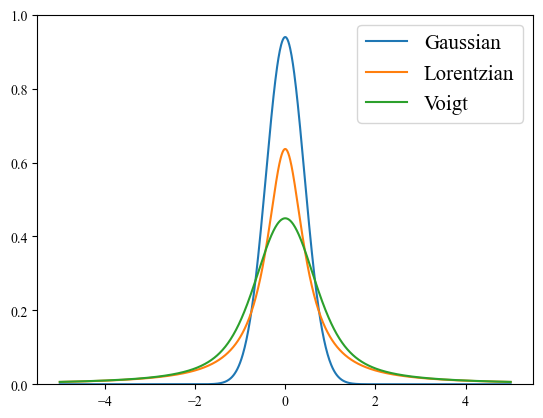
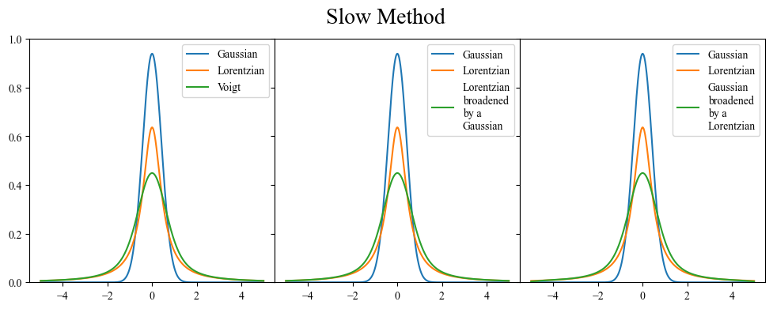
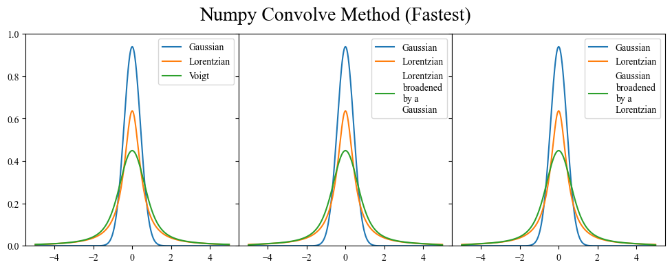
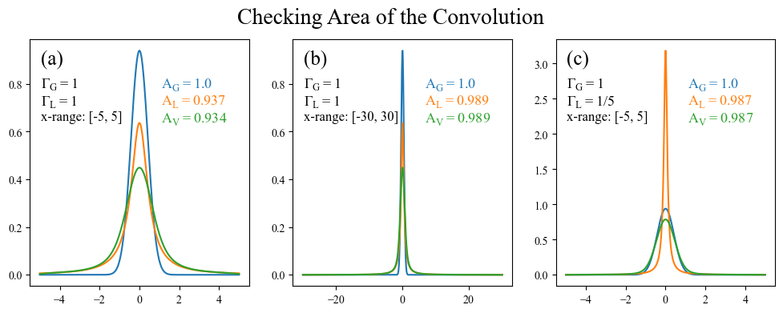
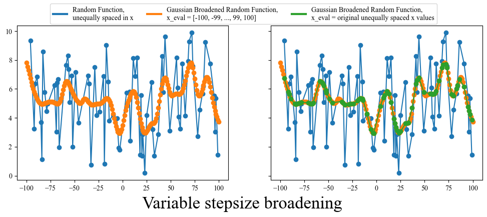

In science, we often have to deal with distributions. Whether there is some a distribution of noise in our data, or some underlying physics influencing our measurements, we will always have to contend with these background processes. This is often discussed in terms of a convolutions, where two processes mix together at every point (usually one process you actually care about and another process that you couldn't care less about).

<p align="center">
  
</p>
<p align = "center">
Broad Python
</p>

Mathematically a convolution is defined as $$\[f \star g\](x) = \int_{-\infty}^{\infty} f(\tau)g(x-\tau) d\tau$$.
These convolutions are a well studied functions, and if you want to explore them in more detail there are many creative animations and explanations that can be found on the internet ([link1](https://mathworld.wolfram.com/Convolution.html), [link2](https://www.youtube.com/watch?v=KuXjwB4LzSA&ab_channel=3Blue1Brown)). In the context of measured data, we usually use the word "broadening" instead of convolution, but they effectively mean the same thing. Usually our data is convolved with some other distribution which ends up broadening peaks and making any features fuzzier. Given this, being able to simulate broadening is critical for comparing calculated values to experiment, and also is generally helpful for understanding what is going on within our data. 

In this post I will discuss how to implement broadening within Python for a few situations, as well as common mistakes that you will want to watch out for. All of the code I discuss is available [here](https://github.com/CharlesCardot/BroadeningTutorial), and I *highly* recommend you take the time to experiment with it before using it in your own projects (learn from my mistakes).

## Introduction

To begin, let's start by getting comfortable with the tools that we are going to be working with. Below are a few of the background distributions that I encounter most commonly in my research. Note that we'll use these function in the following examples, but you can substitute them with whatever abitrary function fits your needs.

- Gaussian: By far the most well known distribution in all of science thanks to the central limit theorem 
    - $G(x, \sigma) = \frac{1}{\sigma \sqrt(2 \pi)} exp \left( -\frac{1}{2} \frac{(x-\mu)^2}{\sigma^2} \right)$
- Lorentzian: Sometimes refered to as a Cauchy distribution 
    - $L(x, \Gamma) = \frac{1}{\pi} \frac{\Gamma/2}{(x-\mu)^2 - (\Gamma/2)^2} $
- Voigt: Convolution of a Gaussian and a Lorentzian (just to add a little spice) 
    - $ V(x, \sigma, \Gamma) = \int_{-\infty}^{\infty} G(x', \sigma)L(x-x', \Gamma) dx' $

```
import scipy
import numpy as np
import matplotlib.pyplot as plt
import time

def Gaussian(x, N, FWHM, mu):
    sigma = FWHM/(2*np.sqrt(2*np.log(2)))
    Gauss = N * 1/ (sigma * np.sqrt(2*np.pi)) * np.exp(-(x-mu)**2 / (2 * sigma**2))
    return Gauss

def Lorentzian(x, N, FWHM, mu):
    Lorentz = N * 1/(np.pi) * (FWHM/2) / ((x-mu)**2 + (FWHM/2)**2)
    return Lorentz

def Voigt(x, N, G_FWHM, L_FWHM, mu):
    sigma = G_FWHM/(2*np.sqrt(2*np.log(2)))
    L_HWHM = L_FWHM/2 # Scipy's voigt_profile expects Half Width at Half Max
    return N * scipy.special.voigt_profile(x-mu, sigma, L_HWHM)

# FWHM = Full Width at Half Maximum, basically how wide (or fat) the peak is
# N = Multiplicative factor, N=1 means the normalized curve is multiplied everywhere by 1
# mu = x offset, basically where the tallest point of the peak is

G_FWHM = 1
L_FWHM = 1
N = 1
mu = 0

x = np.linspace(-5, 5, 1001)
plt.plot(x, Gaussian(x, N, G_FWHM, mu), label = "Gaussian")
plt.plot(x, Lorentzian(x, N, L_FWHM, mu), label = "Lorentzian")
plt.plot(x, Voigt(x, N, G_FWHM, L_FWHM, mu), label = "Voigt")
plt.legend()
plt.ylim(0,1)
plt.show()
```

<p align="center">
  
</p>

Scipy does the heavy lifting of already giving us a built in function, the Voigt function, which is the convolution of a Gaussian and a Lorentzian. In this case, if my signal was the Gaussian (blue), I would say it is "broadened" by a Lorentzian (orange), resulting in a Voigt (green). 

## Section 1: How to calculate a convolution in Python

Let's see if we can do make a Voigt by ourselves without cheating from Scipy's special library.

The nature of the problem lends itself most directly to a double for loop. We need to integrate (sum) over an entire range of values (-$\infty$ to $\infty$) for each value of the new function (the convolution). Go back to the equation we defined at the beginning, or some of the references if you are confused by this statement.

Take some time to read through the logic in the functions below, and convince yourself that you understand what they doing. Start with the `LorentzianBroadening_slow` as it is a slightly simpler formula than the Gaussian one.

### Slow Method (Double For Loop)

```
def LorentzianBroadening_slow(arr, FWHM):
    temp = np.zeros(len(arr[0]))
    dtau = np.abs(arr[0][1]-arr[0][0])
    for i_out in range(len(arr[0])):
        for i_in in range(len(arr[0])):
            temp[i_out] += arr[1][i_in] * FWHM/(2*np.pi) / ((dtau*(i_out-i_in))**2 + (FWHM/2)**2) * dtau
    arr[1] = np.asarray(temp)
    return arr

def GaussianBroadening_slow(arr, FWHM):
    temp = np.zeros(len(arr[0]))
    dtau = np.abs(arr[0][1]-arr[0][0])
    sigma = FWHM/(2*np.sqrt(2*np.log(2)))
    norm_const = 1 / (sigma * np.sqrt(2*np.pi))
    for i_out in range(len(arr[0])):
        for i_in in range(len(arr[0])):
            temp[i_out] += arr[1][i_in] * norm_const * np.exp(-1/2 * ((i_out-i_in)*dtau)**2 / sigma**2) * dtau
    arr[1] = np.array(temp)
    return arr

start_time = time.time()

fig, ax = plt.subplots(1,3, sharey=True, figsize=(12, 4))
fig.subplots_adjust(wspace=0)

ax[0].plot(x, Gaussian(x, N, G_FWHM, mu), label = "Gaussian")
ax[0].plot(x, Lorentzian(x, N, L_FWHM, mu), label = "Lorentzian")
ax[0].plot(x, Voigt(x, N, G_FWHM, L_FWHM, mu), label = "Voigt")

arr_LbyG = LorentzianBroadening_slow(arr = [x, Gaussian(x, N, G_FWHM, mu)], FWHM = 1.0)
ax[1].plot(x, Gaussian(x, N, G_FWHM, mu), label = "Gaussian")
ax[1].plot(x, Lorentzian(x, N, L_FWHM, mu), label = "Lorentzian")
ax[1].plot(arr_LbyG[0], arr_LbyG[1], label="Lorentzian\nbroadened\nby a \nGausssian")

arr_GbyL = GaussianBroadening_slow(arr = [x, Lorentzian(x, N, L_FWHM, mu)], FWHM = 1.0)
ax[2].plot(x, Gaussian(x, N, G_FWHM, mu), label = "Gaussian")
ax[2].plot(x, Lorentzian(x, N, L_FWHM, mu), label = "Lorentzian")
ax[2].plot(arr_GbyL[0], arr_GbyL[1], label="Gaussian\nbroadened\nby a \nLorentzian")

end_time = time.time()
print("Time to completion:", end_time - start_time)

for i in range(3):
    ax[i].legend()
    ax[i].set_ylim(0,1)

fig.suptitle("Slow Method", fontsize = 20)
plt.show()
```

`Time to completion: 1.915595293045044`



You probably have noticed that the two functions defined above are followed by the suffix `_slow`. This is because a double for loop, while illustrative of the task, is not the most efficient way to calculate the broadened curve. In fact, we can take advantage of some of numpy's efficiency by doing one of the loops in terms of numpy arrays.

### Fast Method (Numpy Arrays)

```
def LorentzianBroadening_fast(arr, FWHM):
    temp = np.zeros(len(arr[0]))  
    dtau = np.abs(arr[0][1]-arr[0][0])
    for i in range(len(arr[0])):
        kernel = FWHM/(2*np.pi) * 1/((arr[0]-arr[0][i])**2 + (FWHM/2)**2)
        temp[i] = np.dot(kernel,arr[1]) * dtau
    arr[1] = np.array(temp)
    return arr

def GaussianBroadening_fast(arr, FWHM):
    temp = np.zeros(len(arr[0]))
    dtau = np.abs(arr[0][1]-arr[0][0])
    sigma = FWHM/np.sqrt((8*np.log(2)))
    norm_const = 1 / (sigma * np.sqrt(2*np.pi))
    for i in range(len(arr[0])):
        kernel = norm_const * np.exp(-1/2 * (arr[0]-arr[0][i])**2 / sigma**2)
        temp[i] = np.dot(kernel,arr[1]) * dtau 
    arr[1] = np.array(temp)
    return arr

start_time = time.time()

fig, ax = plt.subplots(1,3, sharey=True, figsize=(12, 4))
fig.subplots_adjust(wspace=0)

ax[0].plot(x, Gaussian(x, N, G_FWHM, mu), label = "Gaussian")
ax[0].plot(x, Lorentzian(x, N, L_FWHM, mu), label = "Lorentzian")
ax[0].plot(x, Voigt(x, N, G_FWHM, L_FWHM, mu), label = "Voigt")

arr_LbyG = LorentzianBroadening_fast(arr = [x, Gaussian(x, N, G_FWHM, mu)], FWHM = 1.0)
ax[1].plot(x, Gaussian(x, N, G_FWHM, mu), label = "Gaussian")
ax[1].plot(x, Lorentzian(x, N, L_FWHM, mu), label = "Lorentzian")
ax[1].plot(arr_LbyG[0], arr_LbyG[1], label="Lorentzian\nbroadened\nby a \nGausssian")

arr_GbyL = GaussianBroadening_fast(arr = [x, Lorentzian(x, N, L_FWHM, mu)], FWHM = 1.0)
ax[2].plot(x, Gaussian(x, N, G_FWHM, mu), label = "Gaussian")
ax[2].plot(x, Lorentzian(x, N, L_FWHM, mu), label = "Lorentzian")
ax[2].plot(arr_GbyL[0], arr_GbyL[1], label="Gaussian\nbroadened\nby a \nLorentzian")

end_time = time.time()
print("Time to completion:", end_time - start_time)

for i in range(3):
    ax[i].legend()
    ax[i].set_ylim(0,1)

fig.suptitle("Fast Method", fontsize = 20)
plt.show()
```

`Time to completion: 0.04207873344421387`


Let's pause here to acknowledge two things.

1. We managed to demonstrate that a Voigt function is indeed the convolution of a Lorentzian and a Gaussian. What's more is that it doesn't matter what order we perform the convolution in. Going Gaussian -> Lorentzian vs Lorentzian -> Gaussian gives the same curve. This is a general result, and it is also clear mathematically when we look at the formula for a convolution $\[f \star g\](x) = \int_{-\infty}^{\infty} f(\tau)g(x-\tau) d\tau$ and realize that if we swap our definitions of $f$ and $g$, and then perform u-substitution on the argument of $g$, we can return to the original equation ([proof](http://wittawat.com/posts/convolution_commutative.html)).

2. As with every coding task, there are many different ways to accomplish the same thing. However not all are necessarily equivalent. There is a nearly two order of magnitude difference between the double for loop and the numpy array methods, in terms of time saved. This becomes increasingly important when you start dealing with complicated spectra or functions that have a lot of data points.

The fastest implementation that I have ever seen involves the numpy.convolve function (shown below), and it is the one that I recommend using if you are ever working with very large data sets. However, it has the drawback of just being someone else's convolve function, without a lot of transparency. If you ever have an issue with your broadening and want to do some testing, you may have to go digging around in the numpy source code.

### Numpy Convolve Method (Fastest)

```
def LorentzianBroadening_convolve(arr, FWHM):
    dtau = np.abs(arr[0][1]-arr[0][0])
    func = Lorentzian(x=arr[0], N=1, FWHM=FWHM, mu=0)
    arr[1] = np.convolve(arr[1], func, mode="same") * dtau
    return arr

def GaussianBroadening_convolve(arr, FWHM):
    dtau = np.abs(arr[0][1]-arr[0][0])
    func = Gaussian(x=arr[0], N=1, FWHM=FWHM, mu=0)
    arr[1] = np.convolve(arr[1], func, mode="same") * dtau
    return arr

start_time = time.time()

fig, ax = plt.subplots(1,3, sharey=True, figsize=(12, 4))
fig.subplots_adjust(wspace=0)

ax[0].plot(x, Gaussian(x, N, G_FWHM, mu), label = "Gaussian")
ax[0].plot(x, Lorentzian(x, N, L_FWHM, mu), label = "Lorentzian")
ax[0].plot(x, Voigt(x, N, G_FWHM, L_FWHM, mu), label = "Voigt")

arr_LbyG = LorentzianBroadening_convolve(arr = [x, Gaussian(x, N, G_FWHM, mu)], FWHM = 1.0)
ax[1].plot(x, Gaussian(x, N, G_FWHM, mu), label = "Gaussian")
ax[1].plot(x, Lorentzian(x, N, L_FWHM, mu), label = "Lorentzian")
ax[1].plot(arr_LbyG[0], arr_LbyG[1], label="Lorentzian\nbroadened\nby a \nGaussian")

arr_GbyL = GaussianBroadening_convolve(arr = [x, Lorentzian(x, N, L_FWHM, mu)], FWHM = 1.0)
ax[2].plot(x, Gaussian(x, N, G_FWHM, mu), label = "Gaussian")
ax[2].plot(x, Lorentzian(x, N, L_FWHM, mu), label = "Lorentzian")
ax[2].plot(arr_GbyL[0], arr_GbyL[1], label="Gaussian\nbroadened\nby a \nLorentzian")


end_time = time.time()
print("Time to completion:", end_time - start_time)

for i in range(3):
    ax[i].legend()
    ax[i].set_ylim(0,1)

fig.suptitle("Numpy Convolve Method (Fastest)", fontsize = 20)
plt.show()
```

`Time to completion: 0.030141592025756836`



## Section 2: Common pitfalls

Okay, so now we know how to calculate the convolution of two functions within Python. How can we check our work? 

### Normalization
A convolution $\[f \star g\](x)$ should always have an area equal to the product of areas of the two functions being convolved ($f(x)$ and $g(x)$) ([proof](https://math.stackexchange.com/questions/3920639/is-convolution-area-preserving)). This is simple enough to check, so let's do so.

```
fig, ax = plt.subplots(1,3, figsize=(12, 4))

# x-range of 10
x = np.linspace(-5, 5, 1001)
Lorentzian = Lorentzian(x=x, N=1, FWHM=L_FWHM, mu=0)

Gaussian = Gaussian(x=x, N=1, FWHM=G_FWHM, mu=0)
dtau = np.abs(x[1]-x[0])
Voigt = np.convolve(Gaussian, Lorentzian, mode="same") * dtau
G_area = "Gaussian Area: " + str(round(scipy.integrate.trapz(Gaussian, x),3))
L_area = "Lorentzian Area: " + str(round(scipy.integrate.trapz(Lorentzian, x),3))
V_area = "Voigt Area: " + str(round(scipy.integrate.trapz(Voigt, x),3))
ax[0].plot(x, Gaussian, label = G_area)
ax[0].plot(x, Lorentzian, label = L_area)
ax[0].plot(x, Voigt, label = V_area)
ax[0].legend()


# x-range of 100
x = np.linspace(-50, 50, 1001)
Lorentzian = Lorentzian(x=x, N=1, FWHM=L_FWHM, mu=0)

Gaussian = Gaussian(x=x, N=1, FWHM=G_FWHM, mu=0)
dtau = np.abs(x[1]-x[0])
Voigt = np.convolve(Gaussian, Lorentzian, mode="same") * dtau
G_area = "Gaussian Area: " + str(round(scipy.integrate.trapz(Gaussian, x),3))
L_area = "Lorentzian Area: " + str(round(scipy.integrate.trapz(Lorentzian, x),3))
V_area = "Voigt Area: " + str(round(scipy.integrate.trapz(Voigt, x),3))
ax[1].plot(x, Gaussian, label = G_area)
ax[1].plot(x, Lorentzian, label = L_area)
ax[1].plot(x, Voigt, label = V_area)
ax[1].legend()


# x-range of 10 but smaller L_FWHM
x = np.linspace(-5, 5, 1001)
Lorentzian = Lorentzian(x=x, N=1, FWHM=L_FWHM/10, mu=0)

Gaussian = Gaussian(x=x, N=1, FWHM=G_FWHM, mu=0)
dtau = np.abs(x[1]-x[0])
Voigt = np.convolve(Gaussian, Lorentzian, mode="same") * dtau
G_area = "Gaussian Area: " + str(round(scipy.integrate.trapz(Gaussian, x),3))
L_area = "Lorentzian Area: " + str(round(scipy.integrate.trapz(Lorentzian, x),3))
V_area = "Voigt Area: " + str(round(scipy.integrate.trapz(Voigt, x),3))
ax[2].plot(x, Gaussian, label = G_area)
ax[2].plot(x, Lorentzian, label = L_area)
ax[2].plot(x, Voigt, label = V_area)
ax[2].legend()

fig.suptitle("Checking Area of the Convolution", fontsize = 20)
plt.show()
```



Ah! This exercise was enlightening in multiple ways. Not only did it allow us to confirm that the product of the areas is indeed preserved through convolutions, but it showed us a shortcoming that was not necessarially tied the broadening method being used. A Lorentzian has especially long tails (compared to a Gaussian), and therefore still has non-negligible weight 5 units away from its peak. This can be quickly confirmed by plotting the above left subplot on a log axis (an exercise left to the reader).

a) The formula we use for a Lorentzian is normalized to an area under the curve of 1. This assumes that the integration of the Lorentzian is performed from $-\infty$ to $\infty$, and therefore when we integrate over the range $-5$ to $5$ we will get a value less than 1. What's more, the area of the Voigt (0.934) is roughly equal to the area of the Lorentzian (0.937) times the area of the Gaussian (1.0), validating our earlier assertion that the area of the convolution is equal to the product of the areas. There is a slight disagreement on the order of $10^{-3}$ which is due to a combination of boundary effects from the numpy convolve function and the numerical integration.

b) When we expand the x range to $-30$ to $30$ we see that the Lorentzian tails have much more space to die off before reaching the edge, leading to an area under the Lorentzian which much closer to 1. The x-range is also large enough that boundary effects are weak enough to not even be noticable and the area of the Voigt is exactly equal to the area of the Lorentzian (at least out to 3 digits). 

c) Finally, we can get a similar effect by reducing the Lorentzian FWHM (making it more narrow) while using the original $-5$ to $5$ range. 

**The takeaway from this is that one needs to be careful about the edge behavior of whatever functions are being broadened together.** If you have a very large x range relative to the spread of the broadening function, then you are most likely fine. However edge effects start to become prevalent when the x-range is comparable to the FWHM (or whatever width paramter you use).

### Variable x-axis or Variable stepsize

There is one final pitfall that should be addressed: occasionally in science you can get data with a variable x-axis. If you look through all the broadening functions we have defined so far you will note that they all depend on the x-axis being uniform (equally spaced). This is a problem for a variable x-axis, because the stepsize will not always be the same, basically meaning that the $d\tau$ (stepsize) in our convolution equation is not a constant.

There are a few ways to deal with this, the first being simply rebinning your data to make it uniformly spaced. However this comes at the cost of potentially loosing information. You could also try linear interpolation between points, making the new stepsize equal to the smallest previous stepsize, but this isn't always reasonable. Finally, you could just use the broadening function that I am about to give you. Funnily enough, this particular piece of code has been pased down through two previous grad students who have come before me and had to deal with similar issues. I have modified it for my own use, but with a bit of experimentation you should be able to also adapt it to your particular problem.

```
# From Sam's code, https://github.com/Seidler-Lab/Sulfur-ML (tddftoutputparser.py)
# Thank you stackoverflow
# https://stackoverflow.com/questions/24143320/gaussian-sum-filter-for-irregular-spaced-points
def gaussian_broaden(arr, FWHM, x_eval):
    '''
    Broadens an [x,y] 1D function by convolving it with a Gaussian. This aproach
    also works for broadening functions that that are unequally spaced in x, which is important for
    experimental spectra (in my experience).

    Parameters
    ----------
    arr: [x,y] numpy array
        The 1D function to be broadened where arr[0] is an array of x values,
        and arr[1] is an array of corresponding y values
    FWHM: float
        The FWHM of the Gaussian being used for broadening
    x_eval: numpy array
        x-values for the convolution to be evaluated at,
        this also does not need to be evenly spaced
    '''
    
    x, y = arr
    sigma = FWHM/(2*np.sqrt(2*np.log(2)))

    delta_x = x - x_eval[:, None]
    weights = np.exp(-delta_x*delta_x / (2*sigma*sigma)) / (np.sqrt(2*np.pi) * sigma)
    weights /= np.sum(weights, axis=1, keepdims=True)
    y_eval = np.dot(weights, y)

    return np.array([x_eval, y_eval])


fig, ax = plt.subplots(1,2, figsize=(12, 4), sharey=True)
x = np.unique(np.random.randint(low=-100, high=100, size=(1,100)))
y = np.random.random(size=(len(x))) * 10
ax[0].plot(x, y, 'o-')
ax[1].plot(x, y, 'o-')

x_eval = np.arange(-100, 100.1, 1)
arr = gaussian_broaden(arr=[x,y], FWHM=10, x_eval=x_eval)
ax[0].plot(arr[0], arr[1], 'o-')
ax[1].plot(arr[0], arr[1], 'o-')

x_eval = x
arr = gaussian_broaden(arr=[x,y], FWHM=10, x_eval=x_eval)
ax[1].plot(arr[0], arr[1], 'o-')

from matplotlib.lines import Line2D
legend_elements = [Line2D([0], [0], color='tab:blue', lw=3, 
                    label='Random Function,\nunequally spaced in x'),
                   Line2D([0], [0], color='tab:orange', lw=3, 
                    label='Gaussian Broadened Random Function,\nx_eval = [-100, -99, ..., 99, 100]'),
                   Line2D([0], [0], color='tab:green', lw=3, 
                    label='Gaussian Broadened Random Function,\nx_eval = original unequally spaced x values'),]
fig.legend(handles = legend_elements, ncols=3, loc=9)

fig.supxlabel("Variable stepsize broadening", fontsize = 20, y=-0.05)
plt.show()
```



Well that's the end of the tutorial. I wrote this somewhat quickly, as I've just spent the last 3 days resolving a particularly nasty bug in my own broadening function, and I wanted a place to summarize all that I've learned. Hopefully these lessons are helpful to someone out there. Thanks for reading this far, and the best of luck on your broadening adventures!

