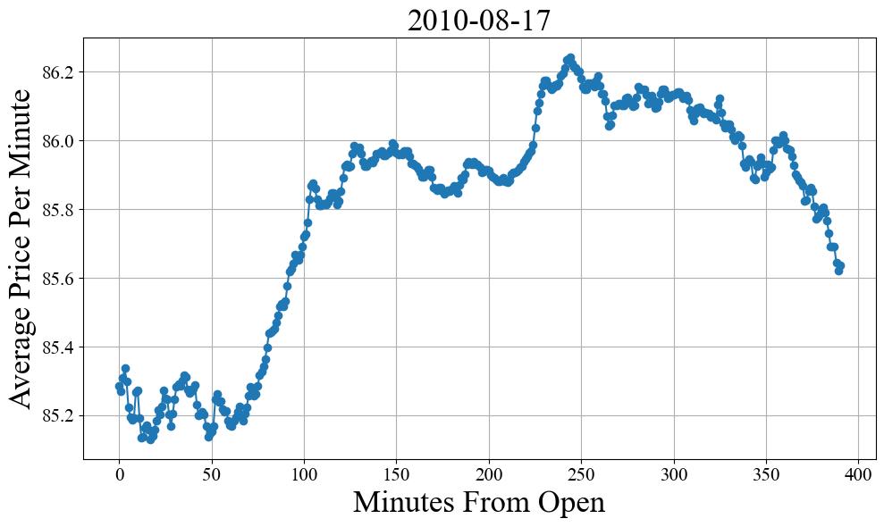
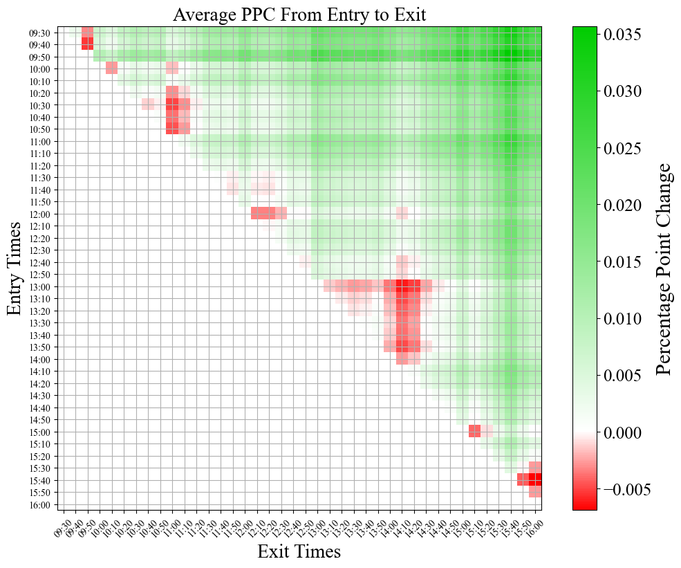
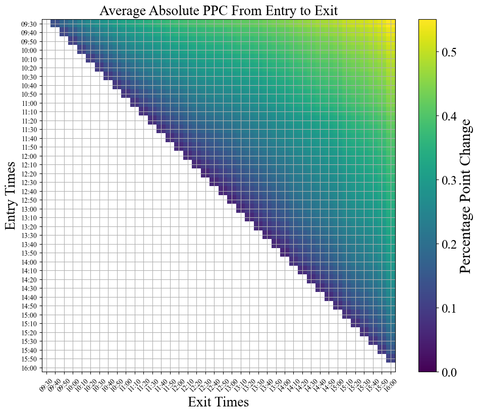
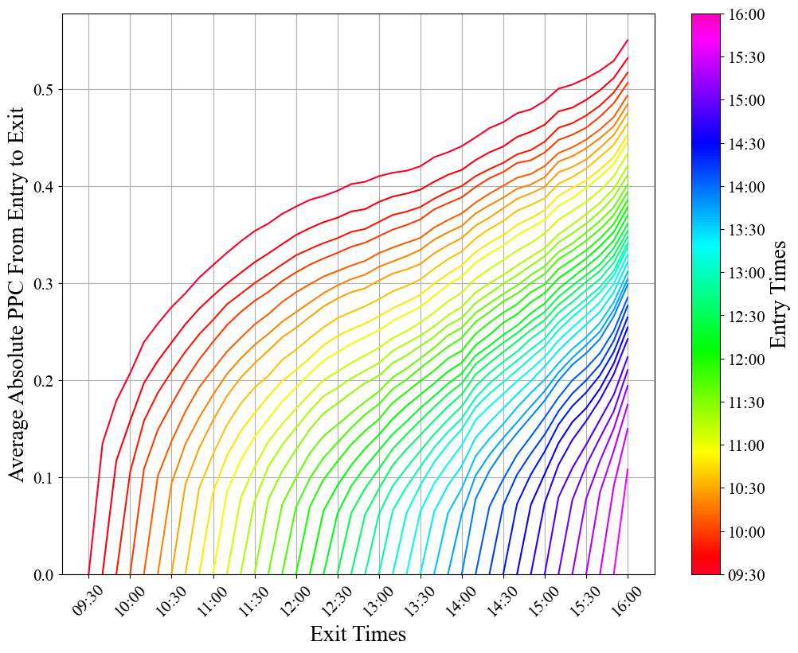
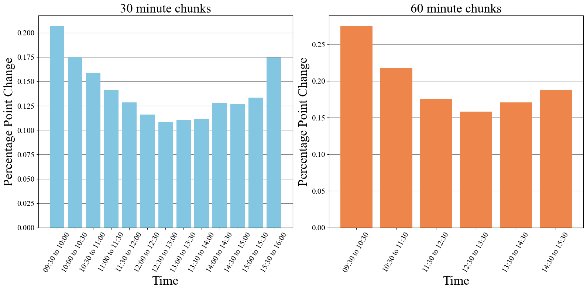

People have been trying to come up with tips, tricks, formulas, and algorithms for trading for as long as markets have existed. The development of new market sectors, the rise of online trading, and the overall increase in *data* have led to trillions of dollars exchanging hands between automated systems. Most of this is done by investment firms with incredibly complicated, highly tuned models, and fancy techniques such as high frequency trading and statistical arbitrage. As someone with a moderate amount of data analysis and ML experience (and an unreasonable amount of self-confidence) I want to see how hard it could be, so I decided to try make my own trading algorithm.

All of the code and data is available on Github at: https://github.com/CharlesCardot/LongShortStrategyOptimization/

**Disclaimer**: None of this is financial advice. We will also make a few approximations that help simplify the market conditions but lead to a simulation that is not very faithful to reality. See the caveats section at the end.

<p align="center">
  
</p>
<p align = "center">
Cambrian Era Trading
</p>

## Stection 1: Data Collection

The first step in any sort of data analysis is of course getting the data. However, there is *a lot* of stock data out there, more than I can fit on a single hard drive. To make it easy, I'm going to focus on the S&P 500, which is an electronically traded fund (ETF) of 500 of the best performing publicly trading companies in the United States. This is a commonly traded, high volume ETF so it's a good place to start. In particular we are going to want minute by minute data, as fine grained as we can get. 

The Alpha Vantage website is a good choice (https://www.alphavantage.co/) for getting data because it's free and has a simple API. The downside is that it has a maximum of 6 requests per minute, 100 requests per day, and will only send 1 month of data at a time, so we must play some games to patch together all the data we want. We'll also request extended hours data just so that we can get values for the price at 16:00:00 (5:00 PM) EST.

(If you'd like to follow along, you may need to make a couple different API keys and change your IP address, *or you can just skip this part and use the data I've already collected*)


```
import re
import os
import json
import copy
import random
import requests

import numpy as np
import pandas as pd
import seaborn as sns
import matplotlib.pyplot as plt
import matplotlib.patches as mpatches

plt.rcParams['xtick.labelsize'] = 15
plt.rcParams['ytick.labelsize'] = 15
plt.rcParams['axes.labelsize'] = 15
plt.rcParams['axes.titlesize'] = 20
plt.rcParams['axes.grid'] = True
plt.rcParams['legend.fancybox'] = True

plt.rcParams['font.family'] = 'serif'
plt.rcParams['font.serif'] = 'Times New Roman'
plt.rcParams['mathtext.fontset'] = 'custom'
plt.rcParams['mathtext.rm'] = 'Times New Roman'

from IPython import display

pd.options.mode.chained_assignment = None  # default='warn'
```

```
with open('secrets.json', 'r') as secrets_file:
    secrets = json.load(secrets_file)

# Define the API endpoint and parameters
endpoint = 'https://www.alphavantage.co/query'
params = {
    'function': 'TIME_SERIES_INTRADAY',
    'symbol': 'SPY',
    'interval': '1min',
    'apikey': secrets["alphavantage_apikey"],
    'extended_hours': 'true',
    'outputsize': 'full',
    'month': '2023-07'
}

# Initialize an empty DataFrame to store the data
full_df = pd.DataFrame()

# Define the date range for data retrieval
start_date = datetime(2016, 7, 1)
end_date = datetime(2023, 7, 31)

counter = 0
# Loop through each month within the date range
current_date = start_date
while current_date <= end_date:
    month = current_date.strftime('%Y-%m')
    params['month'] = month

    print("Requesting data for", month)
    
    # Make the API request
    response = requests.get(endpoint, params=params)
    data = response.json()
    
    # Extract the time series data from the response
    time_series = data.get('Time Series (1min)')
    
    if time_series:
        counter = 0

        # Convert the data to a pandas DataFrame
        df = pd.DataFrame.from_dict(time_series, orient='index')
        df.index = pd.to_datetime(df.index)
        df.columns = ['open', 'high', 'low', 'close', 'volume']
        
        # Filter data between market hours (9:30 AM to 4:00 PM)
        df = df.between_time('09:30:00', '16:00:00')
        
        # Append the current month's data to the full DataFrame
        full_df = pd.concat([full_df, df])
    
        # Move to the next month
        current_date = current_date.replace(day=1) + pd.DateOffset(months=1)
    
    else:
        counter += 1
        print("API request failed, waiting and retrying")
        time.sleep(40) # Maximum API requests per min have been reached

        if counter >= 3:
            print("Used maximum number of API requests for today")
            break

# Sort the full DataFrame by index (date)
full_df.sort_index(inplace=True)

# Save the full DataFrame to a CSV file
full_df.to_csv('full_data_07-2016_to_06-2023.csv')
```

## Section 2: Data Processing, Transformation, and Exploration

Through perfectly ethical means I've managed to get two .csv files that together have minute by minute data for every trading day from August 2010 to August 2023. Now I can shove them together into a single, giant pandas dataframe. Fun fact, did you know that Excel has a limit of roughly 1 million rows and 20K columns? It seems like more than enough and it usually is ... until it's not.

```
market_df_2010to2016 = pd.read_csv("full_data_07-2010_to_06-2016.csv", index_col=0, parse_dates=True)
market_df_2016to2023 = pd.read_csv("full_data_07-2016_to_07-2023.csv", index_col=0, parse_dates=True)
market_df = pd.concat([market_df_2010to2016, market_df_2016to2023])

display.display((market_df.head()))
```

| open | high |	low | close | volume |
|:----:|:----:|:---:|:-----:|:------:|
| 2010-07-01 09:30:00 | 80.639 | 80.754 | 80.393 | 80.502 |	1661899 |
| 2010-07-01 09:31:00 | 80.585 | 80.668 | 80.362 | 80.485 |	797772  |
| 2010-07-01 09:32:00 | 80.569 | 80.653 | 80.308 | 80.454 |	1114100 |
| 2010-07-01 09:33:00 | 80.538 | 80.739 | 80.370 | 80.571 |	1464468 |
| 2010-07-01 09:34:00 | 80.655 | 80.754 | 80.425 | 80.524 |	1032889 |

Each minute row has an **open**,  **high**,  **low**,  **close**, and **volume** column. This is a way of representing how the price moves within a particular time frame (1 minute chunks in this case). The **open** (**close**) is the price at the beginning (end) of the minute, the **high** (**low**) is the highest (lowest) price reached within that minute, and the volume is the number of individual units traded during that minute. We can see that the volume is indeed high, with 1 million or so units traded per minute, and roughly 400 million dollars of value traded within the first 5 minutes of the day. 

These values are good for getting a detailed picture, but if we want to visualize the value of the stock in a particular day we need to do some sort of averaging to get a single value for the minute. Yes, I know about candle charts, but that's more complicated than is necessary right now. A reasonable choice is to take the average the open and close values. We will also break off days into individual dataframes to make the entire data set easier to manage.

(Note this may take 5 to 10 minutes to run, or you can just load the pickle object using the next cell)

```
# Calculate the average of open and close for each minute, 
# round to 3 decimals to be consistent with the other price values
market_df["average"] = round((market_df["open"] + market_df["close"]) / 2, 3)

# Get a list of unique dates in the DataFrame
trading_days = []
for date in market_df.index.date:
    if date not in trading_days:
        trading_days.append(date)

# Sort dataframe into trading days
market_by_days = [market_df[market_df.index.date == date] for date in trading_days]
```

```
import pickle
with open('market_by_days.pkl', 'rb') as f:
    market_by_days = pickle.load(f)

day = market_by_days[32]
minutes_from_open = ((day.index - day.index[0]).total_seconds().astype(int) // 60).tolist()
plt.figure(figsize=(10, 6))

plt.plot(minutes_from_open, day['average'], marker='o', linestyle='-')
plt.xlabel('Minutes From Open', fontsize=25)
plt.ylabel('Average Price Per Minute', fontsize=25)
plt.title(str(day.index[0].date()), fontsize=25)

plt.tight_layout()
plt.show()
```



We have liftoff! Note that because the market opens at 9:30:00 AM EST and closes at 16:00:00 PM EST, this corresponds to 6 and a half hours or 390 total minutes of trading time per day. Now it's time to start looking for trends that can be exploited. One of the simplest things we can try to ask is if certain times of day more correlated with a particular increase or decrease? Do people tend to sell a lot more right at the end of the day so that they can avoid any big overnight market moves? Is there a jump in action around 10:00 AM to 11:00 AM when the west coast wakes up?

To test this, the code block below loops over every day in our `market_by_days` list (in 10 minute chunks) and looks at the percentage point change (PPC) from some start time to some stop time. PPC is defined as (end price - start price) / (start price), so if the ETF starts the day at $100 and ends the day at $110 dollars, that's a PPC of 10%.

```
import datetime

def x_min_trend(df, x_min_start, x_min_stop):
    """ returns the percentage point change from x_min_start to x_min_stop """
    temp = df.between_time(x_min_start, x_min_stop, inclusive="both")["average"].values.tolist()
    return (temp[-1] - temp[0]) / temp[0] * 100 # percent point change

start_time = datetime.time(9, 30, 0)
end_time = datetime.time(16, 0, 0)
time_interval = datetime.timedelta(minutes=10)

times = [] # List of datetime.time objects, spaced 10 minutes apart
current_datetime = datetime.datetime.combine(datetime.datetime.today(), start_time)
while current_datetime.time() <= end_time:
    times.append(current_datetime.time())
    current_datetime += time_interval

returns_arr = [] # row is start time, column is end time
for start_time in times:
    row = []
    for end_time in times:
        if start_time < end_time:
            returns_temp = []
            for df in market_by_days:
                try:
                    returns_temp.append(x_min_trend(df, x_min_start=start_time, x_min_stop=end_time))
                except:
                    pass # For some reason, no data for this minute
            row.append(round(np.asarray(returns_temp).mean(), 5))
        else:
            row.append(np.NaN)
    returns_arr.append(row)
```

```
from matplotlib.colors import LinearSegmentedColormap

# Colors for the colormap
colors = [(1.0, 0.0, 0.0), (1.0, 1.0, 1.0), (0.0, 0.8, 0.0)]  # Red, White, Green

vmax = np.max(np.asarray(returns_arr)[~np.isnan(np.asarray(returns_arr))])
vmin = np.min(np.asarray(returns_arr)[~np.isnan(np.asarray(returns_arr))])

values = [vmin, 0.0, vmax]
norm = plt.Normalize(min(values), max(values))

# Create the custom colormap
custom_cmap = LinearSegmentedColormap.from_list("custom_cmap", list(zip(norm(values), colors)))

plt.figure(figsize=(10, 8))
plt.imshow(returns_arr, cmap = custom_cmap, interpolation = 'nearest')

plt.title("Average PPC From Entry to Exit", fontsize=20)
cbar = plt.colorbar()
cbar.set_label('Percentage Point Change', fontsize=22)
cbar.ax.tick_params(labelsize=18)

plt.xticks(range(len(times)), [t.strftime('%H:%M') for t in times], rotation=45, fontsize=10)
plt.yticks(range(len(times)), [t.strftime('%H:%M') for t in times], fontsize=10)

plt.tight_layout()
plt.ylabel('Entry Times', fontsize=20)
plt.xlabel('Exit Times', fontsize=20)
plt.show()
```



This shows us multiple interesting trends!
1) The average PPC is overwhelmingly positive. This makes a decent amount of sense, as it's well known that the S&P 500 tends to move upwards over time.
2) On average, the best buy time, sell time combo is buying at the beginning of the day (09:30) and selling just before the end of the day (15:40). Another feather in the cap of the buy and hold strategy.
3) On average the worst buy time, sell time combo is buying right at 15:40 and selling at 16:00. This supports our original hypothesis that there is (on average) a general selloff right before the markets close. This is most likely because overnight the price of a stock or ETF can change dramatically in response to events, making it potentially risky to hold an asset overnight.
4) There is also a pretty large red cloud on the 13:00 to 14:00 time frame, but I don't have any strong intuition as to why this could be, other than people coming back from lunch.
5) The times that are more significant to us as a society (hour and half hour marks) can be seen identified by the slight checkerboard pattern that their lines make across the plot. This just goes to show how psychology can be a big part of how the market moves.

At the end of the day though, these are all pretty small PPCs. The maximum avg value we see is 0.03%, which annualized over a year comes in a just under 10% annual returns (accounting for only 252 trading days per year). It's possible that this edge could be exploited by a model which uses the statistical behavior to its advantage, but that kind of near future price direction prediction is difficult at best, and the edge is not that strong. I'd much rather go for something with much more upside. Let's try looking at the average *absolute* PPC to see where the most dramatic price swings are.

```
start_time = datetime.time(9, 30, 0)
end_time = datetime.time(16, 0, 0)
time_interval = datetime.timedelta(minutes=10)

times = [] # List of datetime.time objects, spaced 10 minutes apart
current_datetime = datetime.datetime.combine(datetime.datetime.today(), start_time)
while current_datetime.time() <= end_time:
    times.append(current_datetime.time())
    current_datetime += time_interval

abs_returns_arr = [] # row is start time, column is end time
for start_time in times:
    row = []
    for end_time in times:
        if start_time < end_time:
            returns_temp = []
            for df in market_by_days:
                try:
                    returns_temp.append(x_min_trend(df, x_min_start=start_time, x_min_stop=end_time))
                except:
                    pass # For some reason, no data for this minute
            absolute_ppc = round(np.abs(np.asarray(returns_temp)).mean(), 5)
            row.append(absolute_ppc) 
        else:
            row.append(np.NaN)
    abs_returns_arr.append(row)
```

```
plt.figure(figsize=(10, 8))
plt.imshow(abs_returns_arr, cmap='viridis', interpolation = 'nearest', vmin=0)

plt.title("Average Absolute PPC From Entry to Exit", fontsize=20)
cbar = plt.colorbar()
cbar.set_label('Percentage Point Change', fontsize=22)
cbar.ax.tick_params(labelsize=18)

plt.xticks(range(len(times)), [t.strftime('%H:%M') for t in times], rotation=45, fontsize=10)
plt.yticks(range(len(times)), [t.strftime('%H:%M') for t in times], fontsize=10)

plt.tight_layout()
plt.ylabel('Entry Times', fontsize=20)
plt.xlabel('Exit Times', fontsize=20)
plt.show()
```



```
plt.figure(figsize=(10, 8))

cmap = plt.get_cmap('gist_rainbow')

x = np.arange(0,len(times),1)
for i, row in enumerate(abs_returns_arr):
    last_nan_index = row[::-1].index(np.nan)
    last_nan_index = len(row) - last_nan_index - 1
    row[last_nan_index] = 0
    color = cmap(i / len(abs_returns_arr))
    plt.plot(x, row, color=color)

plt.xticks(np.arange(0, len(times), 3), [t.strftime('%H:%M') for i, t in enumerate(times) if i % 3 == 0], rotation=45)

sm = plt.cm.ScalarMappable(cmap=cmap, norm=plt.Normalize(vmin=0, vmax=len(abs_returns_arr) - 1))
sm.set_array([])
cbar = plt.colorbar(sm, ax=plt.gca(), ticks=np.arange(0, len(times), 3))
cbar.set_label('Entry Times', fontsize=20)
cbar.set_ticklabels([t.strftime('%H:%M') for i, t in enumerate(times) if i % 3 == 0])

plt.ylim(0, None)

plt.tight_layout()
plt.ylabel('Average Absolute PPC From Entry to Exit', fontsize=20)
plt.xlabel('Exit Times', fontsize=20)
plt.show()
```



```
start_time = datetime.time(9, 30, 0)
end_time = datetime.time(16, 0, 0)
time_interval = datetime.timedelta(minutes=30)

times = [] # List of datetime.time objects, spaced 30 minutes apart
current_datetime = datetime.datetime.combine(datetime.datetime.today(), start_time)
while current_datetime.time() <= end_time:
    times.append(current_datetime.time())
    current_datetime += time_interval

abs_returns_arr = [] # row is start time, column is end time
for start_time in times:
    row = []
    for end_time in times:
        if start_time < end_time:
            returns_temp = []
            for df in market_by_days:
                try:
                    returns_temp.append(x_min_trend(df, x_min_start=start_time, x_min_stop=end_time))
                except:
                    pass # For some reason, no data for this minute
            absolute_ppc = round(np.abs(np.asarray(returns_temp)).mean(), 5)
            row.append(absolute_ppc) 
        else:
            row.append(np.NaN)
    abs_returns_arr.append(row)
```

```
y_30 = []
times_30 = [t.strftime('%H:%M') + " to " + times[i+1].strftime('%H:%M') for i, t in enumerate(times) if i != len(times) - 1]
y_60 = []
times_60 = [t.strftime('%H:%M') for i, t in enumerate(times) if i % 2 == 0]
times_60 = [t + " to " + times_60[i+1] for i, t in enumerate(times_60) if i != len(times_60) - 1]

for key, row in enumerate(abs_returns_arr):
    row = np.asarray(row)
    row = row[~np.isnan(row)]
    try:
        y_30.append(row[0])
    except:
        pass
    try:
        if key % 2 == 0:
            y_60.append(row[1])
    except:
        pass

# Create a figure with two subplots in the same row
fig, axes = plt.subplots(1, 2, figsize=(16, 8))

axes[0].set_title('30 minute chunks', fontsize = 25)
axes[0].set_xlabel('Time', fontsize = 25)
axes[0].set_ylabel('Percentage Point Change', fontsize = 25)
axes[0].xaxis.grid(False)
axes[0].yaxis.grid(True, color='gray', zorder=0)
axes[0].bar(times_30, y_30, color=sns.color_palette()[9], zorder=2)
axes[0].set_xticklabels(times_30, rotation=60)

plt.xticks(rotation=45)

axes[1].set_title('60 minute chunks', fontsize = 25)
axes[1].set_xlabel('Time', fontsize = 25)
axes[1].set_ylabel('Percentage Point Change', fontsize = 25)
axes[1].xaxis.grid(False)
axes[1].yaxis.grid(True, color='gray', zorder=0)
axes[1].bar(times_60, y_60, color=sns.color_palette()[1], zorder=2)
axes[1].set_xticklabels(times_60, rotation=60)

plt.tight_layout()
plt.show()
```



## Section 3: Algorithm Design

Our data mining has shown us that the largest percentage point changes are of coming from the times around the open and the close of each day. This makes sense as these are also the most volatile (large number of units being traded). This gives us something to focus on. If we can come up with a strategy that capture the volatility of the opening 30 to 60 minutes, then there is decent potential profits. 

We need a way of making a net gain both when the value increases or decreases, which sounds pretty impossible on the surface, but can be accomplished by with some slightly more sophisticated financial instruments and a careful attention to timing. 

Let's establish some terminology that will make it easier to explain how this idea works.
- **Position**: The ownership of a particular stock, security, or other financial instrument
- **Long Position**: This is a position in which if the value of the underlying asset goes up, then the value of this position also goes up accordingly. This can be as simple as buying and holding a stock.
- **Short Position**: The inverse of a long position (long versus short). If the value of the underlying asset goes up, the value of the position goes down accordingly. See https://en.wikipedia.org/wiki/Short_(finance) for more information.
- **Stop Loss**: This is a price point at which, if the price of the underlying asset is at or below this price, the asset gets sold. If you have a long position and the price of your asset is dropping you want to avoid loosing money. So by setting a stop loss order, you are essentially *stopping any additional losses* by exiting that position.
- **Take Profit**: This is a price at which, if the price of the underlying asset is at or above this price, the asset gets sold. Same concept as the stop loss, except now that the asset has hopefully increased in value up to the price of your take profit, you want to sell it an *take your profits*.

So, if we were to enter both a long and a short position at the same time, it doesn't matter how the value of the underlying asset changes because the two positions will cancel each other out. However, if high volatility causes the asset to jump quickly up or down, we can try to come up with a way of selling the loosing position early (with a stop loss) and hold onto the winning position until it hits a take profit level, exiting with a net profit that is the difference between the take profit and stop loss levels. As long as the directional movement is high enough, and we can time our orders properly, this approach can be profitable. Note: This is the same concept behind a reverse iron condor, but if you already know what that is, then you probably aren't getting much out of my little tutorial to begin with.

Visualizing how these rules play out is much easier with a little simulation, see below.

<p align="center">
  <video width="426" height="640" controls>
  <source src="../img/posts/Images_LongShortPost/SimpleSimulation.mp4" type="video/mp4">
  Your browser does not support the video tag.
  </video>
</p>


