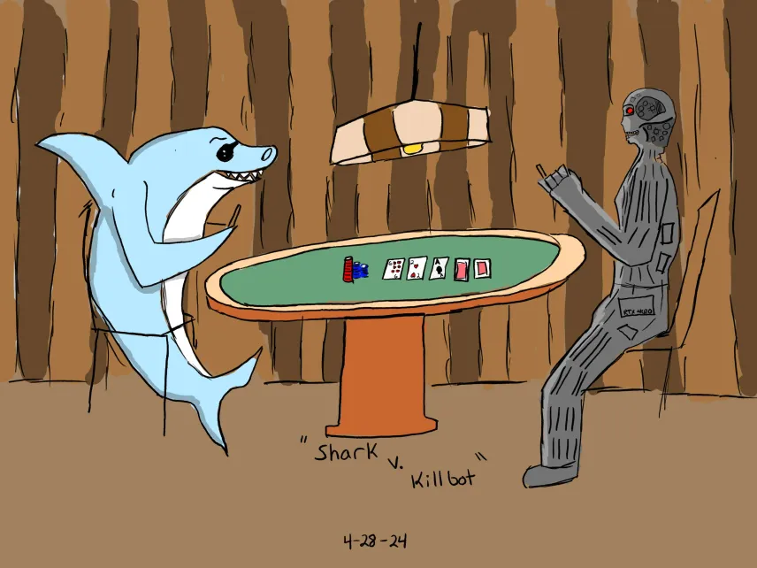
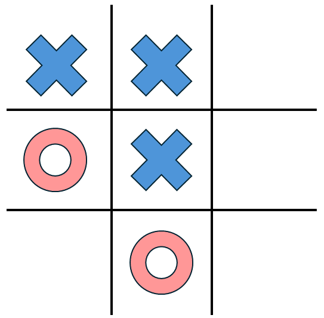
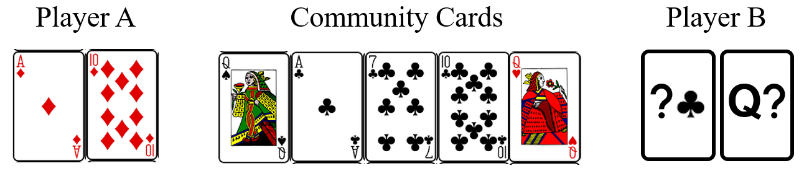
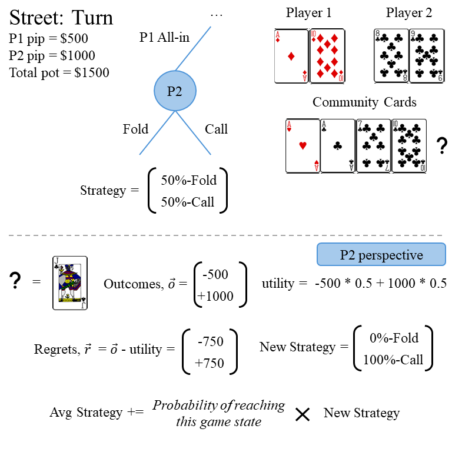
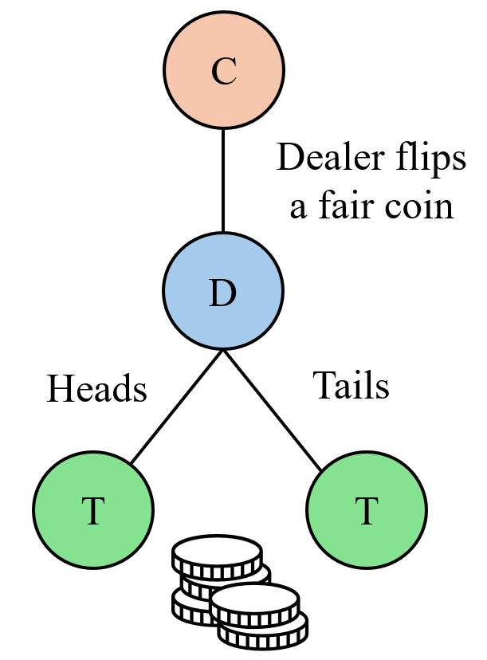
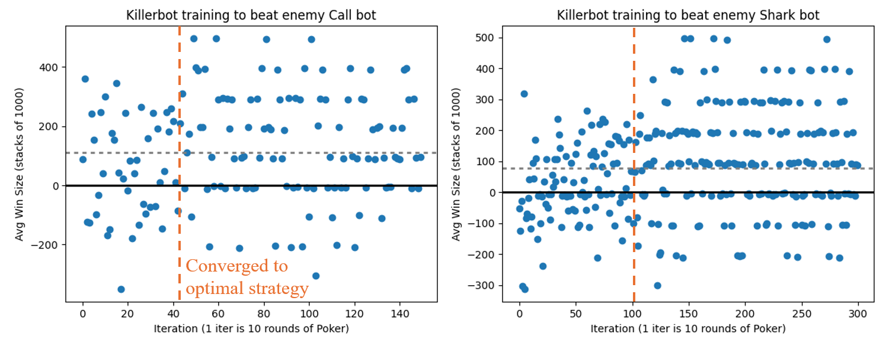

*A dimly lit room, thick with cigarette smoke and the smell of cheap beer. Your opponent across the table sits forward, shoulders hunched, glancing from the cards in his hands to your face and back again. He gingerly pushes half of his stack into the center of the table, like a reluctant church goer when the collection box comes around. You don't even check your own cards before snap shoving every chip you have into the pot. The crest fallen look on his face is all you need to know that you made the right deicision. Your opponent doesn't even look at you as he tosses his cards to the dealer, and you rake in the tumbling mountain of chips to your side of the table. He pleads with you, "At least tell me what you had!?". The corners of your lips turn up slightly, and you reply simply "you have to pay to see 'em".*

<p align="center">
  
</p>
<p align = "center">
Shark versus Killbot, by John Stroud
</p>

**Legal Disclaimer**: The results and techniques discussed below are purely academic in nature and should not be considered as advice. All forms of betting carry financial risk and it is down to the individuals who are making bets to assume responsiblility for any outcomes.

**Gambling problem?**: *Call 1-800-GAMBLER CO, DC, IL, IN, LA, MD, MS, NJ, OH, PA, TN, VA, WV, WY Call 877-8-HOPENY or text HOPENY (467369) (NY) Call 1-800-327-5050 (MA)*

## Forward

This post is intended as a summary of the work that I and the other memebers of the Computational Physics Journal Club at the University of Washington (UW) took on over a roughly 3 month period from February to May in 2024. There were three other contributors not including myself: Micheal Kovtun, Matthew Kafker, and John Stroud. The level of contribution from each person varied with the amount of free time (or urge to procrastinate on real work) that each person had, but the final product is a combination of all of our efforts, and I am incredibly grateful that I was able to work with such a strong, creative team of like minded individuals on an interesting project like this. The topic was born out of a competition that was announced by the Algorithmic Trading Club at UW (https://students.washington.edu/atcuw/hh.html), which was intended to be head to head Poker Bot competition with cash prizes, workshops, and a keynote speaker. Given that the nature of the competition seemed like it would encourage some creative algorithmic and machine learning techniques, it seemed like a natural challenge for a group of technologically minded physics graduate students. Sadly the event never ended up manifesting, and was cancelled due to a lack of participation two days before it was set to be held. Given the time and effort that we put into this project, the news was frustrating to say the least, but we all came away having learned a remarkable amount about the game of poker and all the creative ways that computers have been used to play it. Hopefully this post should give you some idea of what we managed to acomplish over the last 3 months.

## Introduction

In a game like Poker, you are inherently playing with a limited set of information. You don't know what cards your opponent has, or which cards are going to end up being pulled from the deck next. This is in contrast to a game like Chess or Go, where the exact configuration of all the pieces on the board provides complete information to all players. This is of course a dramatic oversimplification of the progress of AI over the last 30 years, but this distinction between 'perfect information' and 'imperfect information' games have led to a divergence in machine learning strategies and levels of sucess when it comes to superhuman (better than the best human players) AI. In the world of AI for games, chess bots like Deep Thought (https://doi.org/10.1007/978-1-4613-9080-0_5) have been able to dominate humans for decades, while the progress of AI in the realm of imperfect information games has lagged significantly in comparison. 

<div align="center">
  
  <p><em>Tic-tac-toe is a "perfect information" game because just by looking at the board both players have full information about the game state. No aspect of play is hidden from either player.</em></p>
</div>

Part of the reason for this comes from the more complicated game state in something like Poker. As already mentioned, in something like tic-tac-toe the path that the players took to get the board into it's current state does not matter at all for figuring out the correct next move. Looking at the image of the tic-tac-toe board, all that matters is where the X's and O's are, and the fact that it's O's turn to go. In Poker however, *the past series of events is just as important as the present state*. This means that the full game state is actually a combination of every decision made up until the point you are currently playing. Let's highlight this with a brief example, but first we need to establish how poker actually works. A full list of rules can be found at https://www.texasholdemonline.com/texas-holdem-rules/ but we'll briefly summarize them here. The game is played with a standard 52 card deck (no jokers) and the goal of the game is to win money from other players. This can be done by either having the strongest 5-card combination or by betting and having all the other players fold. The strength of a 5-card hand is as follows (from best to worst)

**Suits**: Spades (s), Hearts (h), Diamonds (d), Clubs (c)

**Ranks**: Two (2), Three (3), Four (4), Five (5), Six (6), Seven (7), Eight (8), Nine (9), Ten (T), Jack (J), Queen (Q), King (K), Ace (A)

- Royal Flush: (Ace, King, Queen, Jack, Ten) all of the same suit
- Straight Flush: Any 5 cards of the same suit and consecutive rank. Aces are allowed to count as either the highest card or as ones.
- Four of a Kind: Any four cards of the same rank
- Full House: Any three cards from a single rank combined with a pair from a different rank (ex: A Three of a Kind (Js, Jh, Jd) + One Pair (8c, 8s))
- Straigt: Any five cards of consecutive rank
- Three of a Kind: Any three cards of the same rank
- Two pair: Any two pairs of of cards from the same ranks (ex: One Pair (As, Ac) + One Pair (4s, 4d))
- One pair: Any two cards of the same rank
- High Card: Hands that do not fit any of the above categories are ranked based on the highest cards in the hand

Ties within a certain hand rank are often decided by high cards or using the rank of any unused cards. Poker games are broken into hands where you have a set of personal cards (hole cards) and community cards. Each hand is comprised of 4 betting rounds (sometimes called streets). These rounds are pre-flop (no community cards), flop (+3 community cards), turn (+1 community cards, 4 total), and river (+1 community cards, 5 total). Every round, players can either Fold (give up their cards and any money they've bet this round), Check (Indicate that they don't want to bet, which can only be done if no other player has bet this round so far), Call (match the bet of any previous player in the order), and Raise (Bet some amount more than what any other player has previously bet this round). Additionally, there are antees which are known as the small blind and big blind, which are effectively a forced bet that two players have to make at the very beginning of every hand. This servers to keep the game moving by forcing a small amount of skin into the game for one or two players. The blinds will rotate around the entire table multiple times over the course of a normal game to keep things even. Clearly there are a lot of ways that a poker game can shake out and the combinatorics get very nasty very quickly, but that is part of what makes the game challenging. 



Now getting back to the example, assume that Player A and Player B are having a 1v1 game of poker. It's currently on the river round (last betting round) and Player A has a (Ad, Td), with community cards of {'Flop': (Qs, Ac, 7c), 'Turn': (Tc), 'River': (Qh)}. From the perspective of Player A, if Player B played aggresively in the earlier parts of the game (raising with large bet sizes) and is now playing passively, that may be an indicator that Player B has a single clubs card and didn't end up getting a fourth club from the cummunity cards to make a flush. However, if Player B played passively to begin with (check-calling, never raising) and is now playing aggresively in the late game, it may be an indication that Player B has a Queen, and has made of Three of a Kind with the (Qh) from the river. This of course assumes that Player B is playing 'honestly' or betting according to the strength of their own hand/potential future hand, and not bluffing. What this small example demonstrates however is that they behavior of your opponent (assuming you are Player A) over the course of a hand of poker provides crucial information for understanding the current state of the game (e.g. whether you are likely in a strong or a weak position).


## Creating the bot

All of the code used in this project is available on Github at: https://github.com/mkafker/PokerBot.

In an effort to explore multiple potential strategies we split up the work amongst ourselves. Micheal Kovtun developed a C++ poker engine which could be used for simulating 100,000+ hands of poker per second and allowed us to run large head to head tests with incredibly high throughput. I chose to pursue an approach detailed in academic literature known as Counterfactual Regret Minimization (CFR), which has been used extensively over the last 20 years for coming up with Nash equilibrium strategies to simpler versions of poker and is the basis behind most of the state-of-the-art poker engines today. Matthew Kafker designed a zoo of heuristics based bots which allowed us to rapidly prototype various strategies and test our more sophisticated methods against many different simple but formidable opponents. John Stroud acted as a field tester and helped bounce between the heuristic and CFR bots to determine where the weak points are, and gave advice to Matt and I about how we could improve each of our strategies.

### Counterfactual Regret Minimization

Given that this was the part of the project I directly worked on it is the part that I am most equipt to talk about. Other sections detailing my teammates work will include written excerpts and figures from their own work. If you'd like to learn more about how CFR has historically been used for treating No-limit Texas Hold'em Poker and its simpler variants please refer to the excellent documentation at [aipokertutorial.com](https://aipokertutorial.com/the-cfr-algorithm/).

The CFR algorithm is an iterative self-play approach which is similar to traditional reinforcement learning techniques. The algorithm was first introduced in a 2007 paper by Martin Zinkevich *et al.* [Regret Minimization in Games with Incomplete Information](https://poker.cs.ualberta.ca/publications/NIPS07-cfr.pdf). Many summaries and more elloquent talks about this technique exist on the internet (https://www.youtube.com/watch?v=2dX0lwaQRX0&ab_channel=NoamBrown) and I would recommend that you search for them if you'd like to actually learn this algorithm properly. I will try to give a semi-quantitative explanation of it here mostly just for documentation purposes and to explain what we've tweaked. The goal of the algorithm is to come up with a **strategy** which sets the probability of choosing a particular action for a given game state. An example of this would be "If I have pocket aces (A?, A?) pre-flop, I always go all in" or "If I have 2,7 offsuit (2x, 7y) I will always fold, regardless of which street we're on". Pratically, I find that this is simplest if to visualize if you think about it as a dictionary or an unordered set.

```
master_strategy = {
    "Game State 1" : [0.25, 0.50, 0.25],
    "Game State 2" : [1.00, 0.00, 0.00],
    "Game State 3" : [0.00, 0.01, 0.99],
    "Game State 4" : [1.00, 0.00],
    "Game State 5" : [0.33, 0.34, 0.33],
    "Game State 4" : [0.00, 0.00, 0.00, 1.00],
    ...
}
```

The output of the CFR algorithm is essentially a giant dictionary, where for every full game state (which is defined actions taken so far in the street you are currently player, your hole cards, community cards, and all actions taken in past rounds) there is a corresponding vector with a length that is equal to the number of actions it is possible to take. The values in the vector correspond to the probability of choosing the corresponding action for that index.

For example, the game state for a player that has recieved their hole cards and is first 'under the gun' (immediately after the big blind) in a hand would look something like 

```
{
    "Player Order": 0,
    "street": "pre-flop",
    "Hole Cards": ("As", "Kc"),
    "Community Cards": (), 
    "History": ["BB20"]
}
```
Here the big blind is 20, and therefore player can either Fold, Call for the big blind amount, or Raise to some higher number. Ignoring for the moment the amount associate with the raise, this would produce a strategy vector that looks like $\left[ v_F, v_C, v_R \right]$ where $v_i$ is the probability of taking action $i$ with the condition that strategy vector is normalized, $\sum_i v_i = 1$.

I will leave the mathematics of the CFR algorithm to better educators, but I will explain it as best as I can through figures and code. Building the master strategy dictionary will require walking through the entire game tree and assessing what the best probability distribution over all potential actions for a given game state. The easiest way to "assess" the best choices out of all the possible actions will be using a quantity called **regret**. This is similar to how we as humans learn to make choices when doing a task repeatedly. Let's explore this with a small example.

<div align="center">
  
  <p><em>CFR regret calculation and strategy update example. By looking at the outcomes of an action compare to each other, a regret vector can be calculated, where the "regret" is the difference between the outcomes of each choice and the expectation value of all the outcomes given the probability of choice each action (utility).</em></p>
</div>

Player 1 has hole cards (Ad, Td), Player 2 has hole cards (8c, 9c), and the current street is the turn, so the four community cards are (Ah, Ac, 7c, Tc). Both players started with 1000 and have already contributed 500 to the pot, and Player 1 goes first on the turn and all-ins. This leaves the decision to Player 2 to either call for 500 or fold. Assuming that the probability distribution for Player 2's strategy starts with an equal probability wieght across all possible actions, they will Fold 50% of the time and Call 50% of the time. Looking at the outcome of these particular choices, let's assume that the community card from the river is a (Jc), which is exactly what Player 2 needs to make a straight flush and beat Player 1's full house. This leads to Player 2 winning 1000 net from this hand, as opposed to loosing 500 if they had chosen to fold. This is what goes into the *outcomes* vector. The *utility* is an expectation value of the outcomes based on the probability of choosing the action which led to each outcome, as defined by the *strategy*. Finally, *regrets* are calculated as the difference between the *outcomes* and the *utility*. 

This *regrets* vector will get added into a *regret_avg* vector, where it's contribution will be determined by the probability that this node in the game tree is reached. For the sake of clarity I've ommited this detail from the diagram, but essentially it comes down to the fact that you want some "averaged" regret, where the iterations that affect the average are the ones where it is more likely that this node in the game tree is reached. Think of the extreme case, where an action provides an outcome of winning 10 million dollars, but it is very very unlikely that our opponent would actually all in (given the previous game state). We don't want this data point to skew our average too much, because it's effectively an outlier, and therefore we scale it by the probability that our opponent actually chooses the bad option (as well as some other probabilities that come from the likelyhood of getting delt this specific hole card and community card combination).

Using this *regret_avg* vector, a new strategy can be calculated after each iteration, and it's contribution to the *avg_strategy* will also likewise be scaled by the probability of reaching this node in the game tree. All of these get recorded as a part of some object, which we will call an `InformationSet()`. There are three types of nodes in the game tree.
- Decision Nodes: This is where the actual playing of the game is happening. For example a player has to decide to Call or Fold.
- Chance Nodes: This would be where the game is progressing in some probabilistic manner which does not involve player input. An example would be when the dealer first gives you your cards, or when they reveal the flop.
- Terminal Nodes: These are final states in the game. Only once a terminal node is reached and outcomes are determined can regrets be calculated and new strategies be chosen. An example would be a player folding, or going all in.

Let's say you play a game where a dealer flips a fair coin and covers it with their hand, and you have to guess if it's heads or tails. The act of flipping the coin is a chance node. The player making a guess at whether it is heads or tails is a decision node, and determining if they are correct and assigning gains or losses (assuming the player gambled on the outcome of the guess) is a terminal node.

<div align="center">
  
</div> 

The combination of actions from the Decision and Chance nodes make up the unique game state. However the player doesn't know the state of the flipped coin before making their guess so there is only one game state in the dictionary of `InformationSet()` objects, and that single `InformationSet()` will just hold the history of regrets and strategies for every iteration of the coin guessing game that gets played. The reason we have to consider the chance nodes when talking about the game state is that the path taken to reach the decision node matters. Say the dealer has an unfair coin for example, with probability of $99%$ heads and $1%$ tails. As the algorithm goes through multiple iterations of the coin guessing game, eventually the coin will land on heads and the algorithm will guess it correctly. We don't want that event to have an outsized effect on the average strategy though, and that's why we'll use the probabilities from the unfair coin to weight the contribution of any regrets to our average strategy.

#### Game Abstractions

Something we've been sweeping under the rug up until this point is the absolutely enormous number of ways that a game of No Limit Texas Hold'em can play out. Just to start with there are $$ \binom{52}{7} = 133784560 $$ possible 7 card hands you can get as a player. Additionally you need to consider all possible actions at every decision node, because the regrets from each of their eventual terminations will propegate back up recursively to inform the regrets at the current decision node. Naively this could be as simple as Fold, Check, Call, Raise, but the Raise amount can be anything from the Big Blind up to as much money as the player has sitting in front of them. Additionally the game tree includes all of the actions made by a player's opponent, because those actions inform our own strategies. Because of the branching nature of the game tree this very quickly baloons to numbers larger than humans can wrap their brains around. I've seen people estimate that in a standard game of No Limit Texas Hold'em with 20,000 dollar starting stacks there are on the order of ~ $10^{150}$ game states. To give some context there are estimated to be around $10^{80}$ atoms in the universe. This means that to even have a chance in hell of enumerating every game state you'd have to take every atom, replace it with a full universe the size of our own, and then use all of *those* atoms from each new universe. Clearly something needs to be done to simplify this, and people have come up with a whole zoo of techniques, but they fall mainly to two methods.

- Hand abstractions: A (2s, 7h) is pretty similar to a (3c, 7h), as are a lot of other hands. Coming up with methods to reduce the number of unique hands without loosing (too much) information can be a powerful reduction in # of game states.
- Betting abstractions: Still include Fold, Check, Call as individual actions, but for Raise ammounts use some binning of the possible values to reduce the number of branches in the game tree. Ex: Only raise in multiples of 100.

For our bot we chose to implement both of these techniques very aggressively. This was in part because we were using Python for our training and speed was a big issue, and because we it allowed us to more quickly debug and iterate on our bot. For hand abstraction we use a variable that we called **hand_strength** which was related to the probability of winning a showdown of poker. A showdown is what would happen if the player was to all-in at that decision node; assuming the opponnent calls the all-in, all undrawn community cards are immediately drawn and both players compare to assess the winner. We used a Monte Carlo approach, which is a fancy way of saying we ran 10,000 simulations and found the average winrate from that sample, and hoped it was a good approximation of the true **hand_strength**. These types of techniques are well known, and you can even find websites that will do calculations like this for you (https://www.cardplayer.com/poker-tools/odds-calculator/texas-holdem). The advantage here is that instead of having to manage 7 (rank, suit) pairs, we could instead rely on just a single number to represent our hand. This was admitedly a very lossy form of compression, but it provided an okay starting point. In addition to this hand abstraction, we also limited the bet sizes dramatically, but this what just a matter of binning.

#### CFR Code

Now the full details of the code in the CFR implementation are more than I'd like to get in to in this blog post, but I'll briefly share the main function which manages the recursive loop. It first checks for the two base cases, either reaching a chance or termianl node. If a chance node is reached, then cards are either drawn or dealt as needed, and the new `InformationSet()` gets passed back into the recursive loop. If a terminal node is reached, then the winners are determined and the utility of the chosen action gets returned. If a decision node, then a loop is performed over all valid actions to determine the utilities associated with each of them. Remember, utility as a way of quantifying how "good" that decision was (ex: payout or net gain). Then the utilities are used to calcualte the regrets array, which added to a sum after being weighted by the probabilities of reaching this decision node. Finally, the expectation value of the utilities is returned so that the parent decision node can assessed.

```
def mccfr(i_map, start_from, infoset_key=";;", deck = Deck(13, 4), 
        p1_cards=((-1,-1), (-1,-1)), p2_cards=((-1,-1),(-1,-1)), co_cards=((-1,-1)),
        p1_hs_hist = '', p2_hs_hist = '',
        pr_1=1, pr_2=1, pr_c=1):
    """
    Monte Carlo Counterfactual regret minimization algorithm. With hand strength bucketing.

    Parameters
    ----------

    i_map: dict
        Dictionary of all information sets.
    start_from: str
        Player ID of whether to start from P1 or P2 in the Monte Carlo CFR
    infoset_key : A key to represent the game tree path we have taken
        Ex: "P1;1/3;aa/cc/1r2rc", "PlayerID; PreFlop Hand Strength; Flop Hand Strength; History"

        'f': fold
        'c': check/call
        '1r': small raise ($1)
        '2r': larger raise ($2)
        ...
    pr_1 : (0, 1.0), float
        The probability that player 1 reaches `history`.
    pr_2 : (0, 1.0), float
        The probability that player 2 reaches `history`.
    pr_c: (0, 1.0), float
        The probability contribution of chance events to reach `history`.
    """

    if is_terminal_node(infoset_key):
        player_id = infoset_key.split(";")[0]
        return terminal_util_handbuckets(infoset_key, p1_cards, p2_cards, co_cards, player_id, deck)
    
    if is_chance_node(infoset_key):
        return chance_util(i_map, start_from, infoset_key, deck, 
            p1_cards, p2_cards, co_cards,
            p1_hs_hist, p2_hs_hist,
            pr_1, pr_2, pr_c)

    player_id = infoset_key.split(";")[0]
    action_history = infoset_key.split(";")[-1].split('/')
    info_set = get_info_set(i_map, infoset_key)
    strategy = info_set.strategy

    if player_id == "P1":
        info_set.reach_pr += pr_1
    else:
        info_set.reach_pr += pr_2

    # Counterfactual utility per action.
    action_utils = np.zeros(info_set.n_actions)
    
    for i, action in enumerate(valid_actions(infoset_key, _MAX_BET)):
        next_infoset_key = swap_players(infoset_key, p1_hs_hist, p2_hs_hist) + action
        
        if player_id == "P1":
            action_utils[i] = -1 * mccfr(i_map, start_from, next_infoset_key, deck, 
                                    p1_cards, p2_cards, co_cards,
                                    p1_hs_hist, p2_hs_hist,
                                    pr_1 * strategy[i], pr_2, pr_c)
        else:
            action_utils[i] = -1 * mccfr(i_map, start_from, next_infoset_key, deck,
                                    p1_cards, p2_cards, co_cards,
                                    p1_hs_hist, p2_hs_hist,
                                    pr_1, pr_2 * strategy[i], pr_c)        

    # Utility of information set.
    util = sum(action_utils * strategy)
    regrets = action_utils - util

    if player_id == "P1":
        info_set.regret_sum += pr_2 * pr_c * regrets
    else:
        info_set.regret_sum += pr_1 * pr_c * regrets

    return util
```

Both player 1's and player 2's decisions, cards, and probabilities are passed to each node because this is a competitive game, and whether you are the player or the opponent is only determined by which one moves first. With that in mind the algorithm has to determine the appropriate strategy to use for each possible player position, and in that sense CFR is something like a self-play algorithm.

#### Killer Bot

While CFR is a very robust algorithm, the requirement of simplifying your game state for efficiency means that you have to be very smart about what sort of "model" game you are using. If it is too far remeoved from your intended task, then the strategies that the algorithm learns will not translate well to the real world. You also need to make sure that you have a robust translation layer between the true game state and the model ones that you've used for training. All of this is well and good, but it led to us having our fair share of issues when it came time to actually run our trained CFR bot. We weren't able to tweak the model game well enough to match true No Limit Texal Hold'em, while still being able to efficiently move through the entire game tree. This was disapointing, but led us down another route towards a scrappier, more lightweight bot that still took major elements from CFR. It was designed to start with a baseline strategy for a very small number of game states, and then to tweak it's own stragies in real time as it played the same opponent over and over. This would only work in a competition like the one we were planning on entering, where each bot would play each other for thousands of rounds. We hoped that by having a lightweight adaptive strategy instead of a beefy static one, we could more readily respond to anything our opponents threw at us just with some creative learning techniques. We decided to call it our Killer Bot, because it had one purpose, which was to learn how to defeat (kill) a single opponent. The main code for this is shown below, and is built to run on the Husky-Hold'em poker engine (https://github.com/ATC-UW/huskyholdem-engine/) which is largely based off of the mitpokerbots engine (https://github.com/mitpokerbots/engine-2023).

```
class Player(Bot):
    '''
    A pokerbot.
    '''

    def __init__(self):
        '''
        Called when a new game starts. Called exactly once.

        Arguments:
        Nothing.

        Returns:
        Nothing.
        '''

        self.i_map = {}
        self.choices = []
        self.win_history = LimitedList(max_size=500)

        self.deltas = 0
        self.count = 0

        self.learning_rate = 0.1
        self.x = 0.5 # Control bet sizing

        self._HAND_BINS = 5
        print(f"Hand Bin Num: {self._HAND_BINS}")

        pass


    def handle_round_over(self, game_state, terminal_state, active):
        '''
        Called when a round ends. Called NUM_ROUNDS times.

        Arguments:
        game_state: the GameState object.
        terminal_state: the TerminalState object.
        active: your player's index.

        Returns:
        Nothing.
        '''
        
        my_delta = terminal_state.deltas[active]
        self.win_history.append(my_delta / STARTING_STACK)
        avg_result = sum(self.win_history) / len(self.win_history)

        for choice in self.choices:
            infoset_key, action = choice
            print(choice)

            self.i_map[infoset_key][action] += self.learning_rate * (my_delta / STARTING_STACK - avg_result)
        self.choices = []
        for infoset_key in self.i_map.keys():    
            # Make positive
            for key, action in enumerate(self.i_map[infoset_key]):
                if action < 0:
                    self.i_map[infoset_key][key] = 0

            self.i_map[infoset_key] /= np.sum(self.i_map[infoset_key]) # Normalize probability array

        self.deltas += my_delta
        if self.count % 10 == 0:
            self.x += self.learning_rate * self.deltas / STARTING_STACK / 10
            
            # Prevent overbetting and under betting
            if self.x > 1:
                self.x = 1
            if self.x < 0:
                self.x = 0
            
            print(f"On round {self.count}, Avg of last 10 rounds ", round(self.deltas / 10, 2))
            self.deltas = 0
        self.count += 1
        print()

        #my_delta = terminal_state.deltas[active]  # your bankroll change from this round
        #previous_state = terminal_state.previous_state  # RoundState before payoffs
        #street = previous_state.street  # int of street representing when this round ended
        #my_cards = previous_state.hands[active]  # your cards
        #opp_cards = previous_state.hands[1-active]  # opponent's cards or [] if not revealed
        pass
    
    def get_action(self, game_state, round_state, active):
        '''
        Where the magic happens - your code should implement this function.
        Called any time the engine needs an action from your bot.

        Arguments:
        game_state: the GameState object.
        round_state: the RoundState object.
        active: your player's index.

        Returns:
        Your action.
        '''
        
        legal_actions = round_state.legal_actions()  # the actions you are allowed to take
        street = round_state.street  # int representing pre-flop, flop, turn, or river respectively
        my_cards = round_state.hands[active]  # your cards
        board_cards = round_state.deck[:street]  # the board cards
        my_pip = round_state.pips[active]  # the number of chips you have contributed to the pot this round of betting
        opp_pip = round_state.pips[1-active]  # the number of chips your opponent has contributed to the pot this round of betting
        my_stack = round_state.stacks[active]  # the number of chips you have remaining
        opp_stack = round_state.stacks[1-active]  # the number of chips your opponent has remaining


        def checkfold(): # check-fold, defensive
            if CheckAction in legal_actions:
                return CheckAction()
            else:
                return FoldAction()

        def checkcall(): # check-call, neutral
            if CheckAction in legal_actions:
                return CheckAction()
            else:
                return CallAction()

        def callraise(): # call-raise, aggresive
            action = random.choice([0, 1])
            if action == 0:
                if CheckAction in legal_actions:
                    return CheckAction()
                return CallAction()
            else:
                if opp_stack == 0 or my_stack < SMALL_BLIND:
                    return checkcall()
                min_raise, max_raise = round_state.raise_bounds()
                
                raise_amount = int(min_raise * (1-self.x) + max_raise * self.x)
                return RaiseAction(raise_amount)

        # Some stop gap logic
        if my_stack < SMALL_BLIND:
            return checkcall()
        if game_state.game_clock < 1:
            return checkcall()

        # Calculate hand strength
        deck = my_bot.make_deck(my_cards, board_cards)
        avg_win_rate, simulation_results = my_bot.estimate_hand_strength(my_bot.make_cards(my_cards), 
        my_bot.make_cards(board_cards), deck)
        hand_strength = my_bot.clamp_hand_strength(avg_win_rate, self._HAND_BINS)

        infoset_key = (hand_strength)  

        # General Killer Bot
        if infoset_key in self.i_map:
            action = random.choices([0, 1], weights = self.i_map[infoset_key], k = 1)[0] # Either def or agr action
        else:
            self.i_map.update({infoset_key: np.asarray([0.5, 0.5])})
            action = random.choice([0,1])

        self.choices.append((infoset_key, action))

        if action == 0:
            return checkfold()
        else:
            return callraise()
```

The Killer Bot works in a similar way to CFR, where it starts with an equal weighted probability distribution, but only over two actions, which I am calling "defensive" and "aggressive". In an attempt to simplify how the bot learned, the decision tree was abstracted into a set of actions such as folding when raised against or checking which was labeled as defensive, or actions such as raising or calling which were labeled as aggresive. The bet sizes associated with the aggressive choice were scaled depening on the recent performance of the bot (`self.x`). The strategies (whether to play more aggresively or deffensivley for a given hand strength) were updated at the end of every round, where the outcomes where used to update the strategy array acording to some learning rate. Overall this bot was much simpler than some of our other CFR strategy based models that we used, but it was that simplicity that allowed us to quickly tune and deploy it, which as we began to run low on time, became critical to us getting our bot over the finish line.

```
        # Bot switching logic, based on successes/failures from win_history
        if self.count < 2000 or (self.count() >= 2000 and sum(self.win_history) / len(self.win_history)):
            # General Killer
            if infoset_key in self.i_map:
                action = random.choices([0, 1], weights = self.i_map[infoset_key], k = 1)[0] # Either def or agr action
            else:
                self.i_map.update({infoset_key: np.asarray([0.5, 0.5])})
                action = random.choice([0,1])
          
            self.choices.append((infoset_key, action))
          
            if action == 0:
                return checkfold()
            else:
                return callraise()
        elif 2000 <= self.count < 3000 or (self.count() >= 3000 and sum(self.win_history) / len(self.win_history)):
            # All-in bot
            if my_stack < SMALL_BLIND:
                return checkcall()
          
            min_raise, max_raise = round_state.raise_bounds()
            return RaiseAction(max_raise)
        elif 3000 <= self.count < 4000 or (self.count() >= 4000 and sum(self.win_history) / len(self.win_history)):
            # Honest Player optimized against all-in bot
            threshold = 0.375

            if my_stack < SMALL_BLIND:
                return checkcall()

            if avg_win_rate <= threshold:
                return checkfold()
            else:
                return checkcall()
        else:
            # Trained Shark Bot        
            if my_stack < SMALL_BLIND:
                return checkcall()


            if street == 0:
                fold_threshold = 0.1
                bet_threshold = 0.6
            else:
                fold_threshold = 0.1
                bet_threshold = 0.6

            if avg_win_rate <= fold_threshold:
                return checkfold()
            if fold_threshold < avg_win_rate <= bet_threshold:
                return checkcall()
            else:
                return raisemid()
```

This Killer bot also had fallback behavior, where if the recent history implied that the bot was not performing well it could cycle through a series of other simple optimized bots (all-in, honest, or shark) which employed straigt forward strategies as a last ditch effort. The all-in bot can catch out other simple risk adverse strategies. The honest player was designed to defeat an opponent using an all-in bot. The trained shark bot was optimized for fold and bet thresholds and is less risk averse, but also more aggressive. All of these are attempts to counter potential opponent strategies in this bot-versus-bot competition, but it is important to note that it is unlikely that any of these strategies would succeed against a human opponent.

<div align="center">
  
</div> 

Overall, our Killer bot managed to converge rather quickly (500 to 1,000 hands out of 10,000 hands of Poker) against multiple opponents, as demonstrated by the plot above. The gray dashed line shows the winnings of Killer bot over the course of 3,000 hands (for a starting stack of 1,000) with stacks being reset at the end of each hand. Currently Killer bot only has knowledge about the current hand strength, and nothing about past game history. It still manages to perform remarkably well however, as non of the opponents that we tested it against exhibited sophisticated bluffing techniques. However, adding a set of hand histories similar to what we used in our CFR bot is simple and would allow for Killer bot to adapt to more advanced opponents. The main advantage of Killer Bot over CFR bot is there is less concern about creating a sophisticated model poker game for it to iterate over and learn, and instead the goal is simply in providing the Killer bot with the minimum amount of resolution that it needs to determine a winning strategy for the full game in real time, against a specific opponent.


