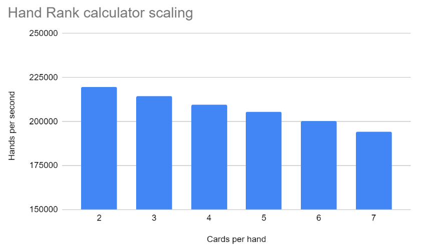
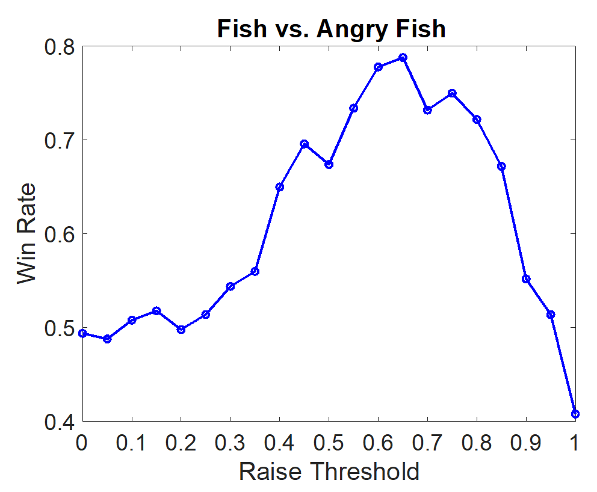
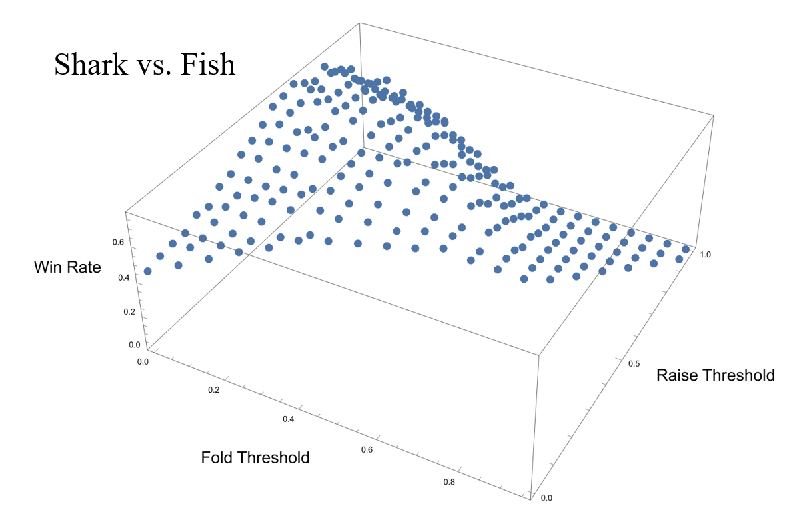
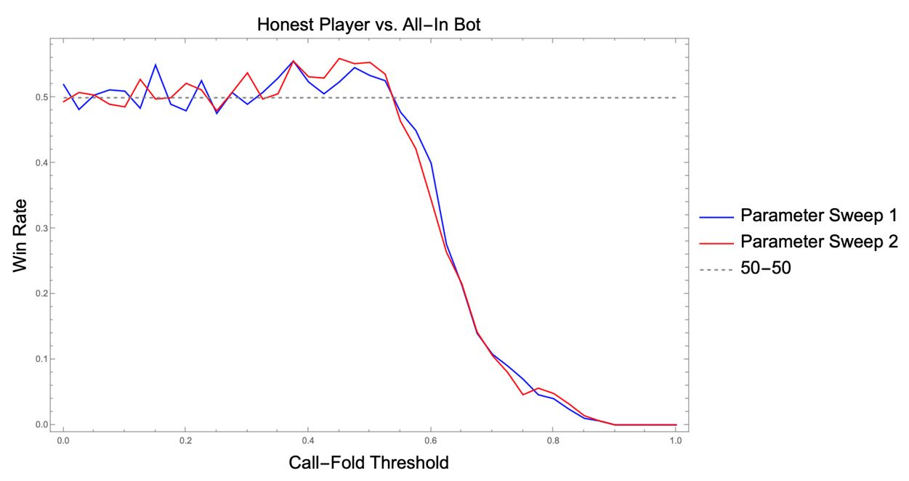
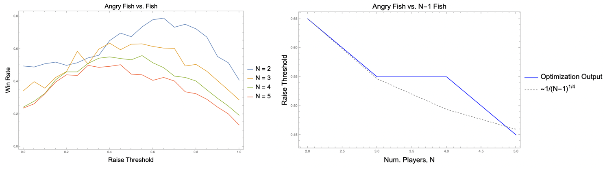

*A dimly lit room, thick with cigarette smoke and the smell of cheap beer. Your opponent across the table sits forward, shoulders hunched, glancing from the cards in his hands to your face and back again. He gingerly pushes half of his stack into the center of the table, like a reluctant church goer when the collection box comes around. You don't even check your own cards before snap shoving every chip you have into the pot. The crest fallen look on his face is all you need to know that you made the right decision. Your opponent doesn't even look at you as he tosses his cards to the dealer, and you rake in the tumbling mountain of chips to your side of the table. He pleads with you, "At least tell me what you had!?". The corners of your lips turn up slightly, and you reply simply "you have to pay to see 'em".*

<p align="center">
  
</p>
<p align = "center">
Shark versus Killbot, by John Stroud
</p>

**Legal Disclaimer**: The results and techniques discussed below are purely academic in nature and should not be considered as advice. All forms of betting carry financial risk and it is down to the individuals who are making bets to assume responsibility for any outcomes.

**Gambling problem?**: *Call 1-800-GAMBLER CO, DC, IL, IN, LA, MD, MS, NJ, OH, PA, TN, VA, WV, WY Call 877-8-HOPENY or text HOPENY (467369) (NY) Call 1-800-327-5050 (MA)*

## Forward

This post is intended as a summary of the work that I and the other members of the Computational Physics Journal Club at the University of Washington (UW) took on over a roughly 3 month period from February to May in 2024. There were three other contributors not including myself: Micheal Kovtun, Matthew Kafker, and John Stroud. The level of contribution from each person varied with the amount of free time (or urge to procrastinate on real work) that each person had, but the final product is a combination of all of our efforts, and I am incredibly grateful that I was able to work with such a strong, creative team of likeminded individuals on an interesting project like this. The topic was born out of a competition that was announced by the Algorithmic Trading Club at UW (https://students.washington.edu/atcuw/hh.html), which was intended to be head-to-head Poker Bot competition with cash prizes, workshops, and a keynote speaker. Given that the nature of the competition seemed like it would encourage some creative algorithmic and machine learning techniques, it seemed like a natural challenge for a group of technologically minded physics graduate students. Sadly the event never ended up manifesting, and was cancelled due to a lack of participation two days before it was set to be held. Given the time and effort that we put into this project, the news was frustrating to say the least, but we all came away having learned a remarkable amount about the game of poker and all the creative ways that computers have been used to play it. Hopefully this post should give you some idea of what we managed to accomplish over the last 3 months.

## Introduction

In a game like Poker, you are inherently playing with a limited set of information. You don't know what cards your opponent has, or which cards are going to end up being pulled from the deck next. This is in contrast to a game like Chess or Go, where the exact configuration of all the pieces on the board provides complete information to all players. This is of course a dramatic oversimplification of the progress of AI over the last 30 years, but this distinction between 'perfect information' and 'imperfect information' games have led to a divergence in machine learning strategies and levels of success when it comes to superhuman (better than the best human players) AI. In the world of AI for games, chess bots like Deep Thought (https://doi.org/10.1007/978-1-4613-9080-0_5) have been able to dominate humans for decades, while the progress of AI in the realm of imperfect information games has lagged significantly in comparison. 

<div align="center">
  
  <p><em>Tic-tac-toe is a "perfect information" game because just by looking at the board both players have full information about the game state. No aspect of play is hidden from either player.</em></p>
</div>

Part of the reason for this comes from the more complicated game state in something like Poker. As already mentioned, in something like tic-tac-toe the path that the players took to get the board into it's current state does not matter at all for figuring out the correct next move. Looking at the image of the tic-tac-toe board, all that matters is where the X's and O's are, and the fact that it's O's turn to go. In Poker however, *the past series of events is just as important as the present state*. This means that the full game state is actually a combination of every decision made up until the point you are currently playing. Let's highlight this with a brief example, but first we need to establish how poker actually works. A full list of rules can be found at https://www.texasholdemonline.com/texas-holdem-rules/ but we'll briefly summarize them here. The game is played with a standard 52 card deck (no jokers) and the goal of the game is to win money from other players. This can be done by either having the strongest 5-card combination or by betting and having all the other players fold. The strength of a 5-card hand is as follows (from best to worst)

**Suits**: Spades (s), Hearts (h), Diamonds (d), Clubs (c)
**Ranks**: Two (2), Three (3), Four (4), Five (5), Six (6), Seven (7), Eight (8), Nine (9), Ten (T), Jack (J), Queen (Q), King (K), Ace (A)

- Royal Flush: (Ace, King, Queen, Jack, Ten) all of the same suit
- Straight Flush: Any 5 cards of the same suit and consecutive rank. Aces are allowed to count as either the highest card or as ones.
- Four of a Kind: Any four cards of the same rank
- Full House: Any three cards from a single rank combined with a pair from a different rank (ex: A Three of a Kind (Js, Jh, Jd) + One Pair (8c, 8s))
- Straigt: Any five cards of consecutive rank
- Three of a Kind: Any three cards of the same rank
- Two pair: Any two pairs of cards from the same ranks (ex: One Pair (As, Ac) + One Pair (4s, 4d))
- One pair: Any two cards of the same rank
- High Card: Hands that do not fit any of the above categories are ranked based on the highest cards in the hand

Ties within a certain hand rank are often decided by high cards or using the rank of any unused cards. Poker games are broken into hands where you have a set of personal cards (hole cards) and community cards. Each hand is comprised of 4 betting rounds (sometimes called streets). These rounds are pre-flop (no community cards), flop (+3 community cards), turn (+1 community cards, 4 total), and river (+1 community cards, 5 total). Every round, players can either Fold (give up their cards and any money they've bet this round), Check (Indicate that they don't want to bet, which can only be done if no other player has bet this round so far), Call (match the bet of any previous player in the order), and Raise (Bet some amount more than what any other player has previously bet this round). Additionally, there are antes which are known as the small blind and big blind, which are effectively a forced bet that two players have to make at the very beginning of every hand. This servers to keep the game moving by forcing a small amount of skin into the game for one or two players. The blinds will rotate around the entire table multiple times over the course of a normal game to keep things even. Clearly there are a lot of ways that a poker game can shake out and the combinatorics get very nasty very quickly, but that is part of what makes the game challenging. 


Now getting back to the example, assume that Player A and Player B are having a 1v1 game of poker. It's currently on the river round (last betting round) and Player A has a (Ad, Td), with community cards of {'Flop': (Qs, Ac, 7c), 'Turn': (Tc), 'River': (Qh)}. From the perspective of Player A, if Player B played aggressively in the earlier parts of the game (raising with large bet sizes) and is now playing passively, that may be an indicator that Player B has a single clubs card and didn't end up getting a fourth club from the community cards to make a flush. However, if Player B played passively to begin with (check-calling, never raising) and is now playing aggressively in the late game, it may be an indication that Player B has a Queen, and has made of Three of a Kind with the (Qh) from the river. This of course assumes that Player B is playing 'honestly' or betting according to the strength of their own hand/potential future hand, and not bluffing. What this small example demonstrates however is that they behavior of your opponent (assuming you are Player A) over the course of a hand of poker provides crucial information for understanding the current state of the game (e.g. whether you are likely in a strong or a weak position).

## C++ Poker Engine Implementation

All of the code used in this project is available on Github at: https://github.com/mkafker/PokerBot.

This section was written by Mikael Kovtun. He took the lead on designing an C++ based Poker Engine which could simulate full games of poker between an arbitrary number of players. This served as a testing grounds where we could un tens of thousands of hands for benchmarking the performance of an algorithm or strategy. Much of the work centered around simple Python poker bot implementations between myself and Matt Kafker, where we then transfered over strategies to be implemented in C++ with an eye towards speed and efficiency.

### Poker Engine Introduction

First, I’m writing this on a cloudy Sunday afternoon as a mental break from the scientific prose my brain is usually subjected to, so don’t mind me for writing a little loosely. I’m writing this today from the perspective of wanting to adapt this code for a version 2.0, one that is made for training counterfactual regret minimization (CFR) algorithms from the get-go, which I’ll mention a few times without really going into detail. This document is slightly different from the ones Matt and Charles wrote, since this part of the project is a poker engine, there’s not really much in the way of results. The main deliverable is that it works and that it’s fast, not some magic poker bot that trounces all the others. This stuff just works in the background, but I think it’s an important background, because in a time-sensitive project like this, which we all work on in our nanoscopic amounts of free time, iteration time is of the essence. Basically, we can’t sit around all day waiting for a bot to train.

#### Motivation

Existing Texas Hold ‘Em libraries from our preliminary search were predominantly written in Python and not actively maintained. We knew going in that we’d eventually be doing some kind of Monte Carlo sampling as the backbone of our bot, which puts the poker engine squarely in the category of “code that cannot run fast enough”. Python is an interpreted language, and while it has its merits, speed is not one of its strengths. Rewriting in a compiled language would likely lead to orders-of-magnitude speedup, which is automatically a massive advantage over any other team using a slower implementation. Furthermore, it may very well be the case that after investing hours of time into learning somebody else’s implementation we find that their code is not structured in a way that permits easy development (“spaghetti code”). Finally, the main purpose of entering this competition is to learn. And while it’s true that using a third-party engine would mean more time for the bot itself, implementing our own high-performance engine would teach us valuable lessons about efficient algorithm implementation, memory layout, and other moieties of fast code. So, we decided that an in-house poker engine was the way to go.

#### Design

When designing a program to implement Texas Hold ‘Em, the first decision to make is what programming paradigm best suits it. This is a game with several actors interacting: players are dealt private cards from a deck, the table holds community cards that every player can see and as well as a communal pot of chips, etc. Because of the partitioning of public and private information, the problem lends itself to object-oriented programming. On top of that, there are several datatypes that would need to be defined: cards and decks are not standard data structures in most programming languages. And for reasons mentioned above, we need this to be fast. All of these factors led us to use C++ as the language of choice. 

### Class and Algorithm Description

#### Card and Deck

The first order of business was to define abstractions for cards and decks, which were the easy part. Cards are simply a class with a Rank and a Suit, which are enums. Decks are basically a vector of cards with a size limit and a special additional constructor whose argument is a vector of cards not to put into the new deck (this feature is used in monte carlo hand strength evaluation). My implementation of the deck constructor (both the default and the special “complement” one) is not ideal. It simply pushes back into its vector of cards, and the only speedup concession I make is pre-sizing the vector. It works and it’s simple, but later I found that during monte carlo runs the deck constructor and shuffling was taking up a significant amount of time. One way to possibly combat this is to use a deck factory idiom, which keeps a const deck in memory and copies it in one fell swoop whenever you request a new deck. The const deck would be stored in a known arrangement so that the complement constructor knows exactly which memory locations to omit in its copy (or, more likely, delete afterwards). Benchmarking deck construction is one thing I haven’t looked at that I should if I want a truly fast implementation.

#### Hand Rank Calculation

The first challenge was to implement the hand strength evaluation routine, which takes a vector of cards as an input and spits out a FullHandRank, which is an example of how to not name a struct, because it is a HandRank (one pair, high card, full house, etc) and two vectors of Cards, the maincards (which the HandRank is describing) and the kickers (which do not). I chose this way because it is closest to how real players play poker, and comparison is easy because we just go down the hierarchy (HandRank, maincards, kickers) and compare piecemeal. There are other ways to do this, such as converting the hand into a large unsigned integer, which simplifies comparison but is algorithmically complex to form. My algorithm attempts to do as few comparisons/computations as possible. The first thing I do is count how many cards are of like suits or ranks, forming a histogram. Then we read off if we have a straight or a flush and record that data for later. If we have both (a straight flush) we have the best hand in the game so we just return then and there. This paradigm of minimal computation is employed throughout the algorithm. Low hanging fruit: this algorithm is completely general in the number of cards. This is frankly obscene, since there is absolutely no reason to check for a straight flush in a card of two hands. But it was good enough for us, so whatever!

<div align="center">
  
  <p><em>The hand rank calculator manages to achieve about 200,000 hands per second. The performance of the hand rank calculator is roughly linear in the number of cards, which is nice but ultimately unimportant since Hold ‘Em is played with 2-7 cards only.
</em></p>
</div>

Now that we have a working hand rank calculator, the next chunk to tackle is the game itself. We’ll need an abstraction of the public information, that is, the players (minus their private hand), pot, bankrolls, community cards, etc. I decided to call this object the Table, since that’s kinda what a poker table represents in real life. We’ll also need an abstraction of the players themselves (the aptly named Player class) and some kind of game manager (the Game) that glues them all together and makes them interact. Choosing where to put crucial game information was a difficult task. Do player bankrolls belong in the Player, or in the Table? Should the Game manage player strategies, or should that follow the Players? A poor decision would manifest as clunky implementation, scope issues, or excessive indirection. Ultimately, I decided that, as a first iteration, I would follow roughly the partitioning that real life has. In my view, that is object-oriented programming played to its strengths. However, I’m not convinced that my solution is the best one. As I saw down the line, when implementing a training class for something that iterates through the game tree like CFR, my partitioning of these objects was not ideal, mostly because of issues of mutability: in CFR, it is desirable to be able to clone the game state and alter it to go down an alternate timeline. It was competition time before I got this to work, but untangling ownership of all these pointers was a difficult task. In the future, closer attention will be paid to how abstractions are moved and copied, as pushing these sorts of things to compile time is one of C++’s strengths.

#### Player

The Player object has a bankroll, an ID, a position (seat at the table), their last Move, their last FullHandRank, their hand, and a pointer to their Strategy. The pointer to the Strategy was a fun one, the Strategy is just an interface to the makeMove function (which is called during the game loop, of course) and a derived class implements it. Therefore only one type of Player needs to be created, minimizing code duplication and bugs. The Player class has all default constructors. This was for coding convenience, but in a CFR implementation where parallel universes need to be computed, perhaps deleting the move constructor is appropriate.

#### Strategy

The Strategy class implements makeMove, which is what is called by the Players when it’s their turn to play. It takes in a pointer to the Table (to access information like the pot, community cards, other Players move histories, etc) and a pointer to the Player whose turn it is (to access their hand, bankroll, etc). Developing this class is what the entire competition was about! I made several “heuristic” bots that were for testing. Call bot called. Fold bot folded. “Matt” estimated his hand strength and folded, called, or raised based on that, the thresholds of which are adjustable from the outside. “Mike” estimated his hand strength and combined it with the enemy player's last move to form an information set, and kept a table of what to do for a particular information set (this idea is the kernel of what the state-of-the-art bots do, just on a much, much higher level). “KillBot” (my favorite) did the same thing as “Mike”, but updated its parameters according to how much it won/lost. It kept track of the path it took through its abstracted information sets and updated their weights after each round. Doing this, it absolutely smoked the call bot, but struggled a bit against all-in bot and more sophisticated ones. A step in the right direction. We came up with KillBot just a few days before the due date, which is of course the best and most productive time to get things done :) 

#### Table 

The Table class is simple. It really should be renamed to PublicGameInfo or something. It has game information: the blind bet amounts, the pot, the running minimum bet, the street, the community cards. It also has a vector of `shared_ptrs` to Players. That’s another low-hanging fruit: I totally abuse the `shared_ptrs`. I think most of these can be converted to `unique_ptrs`. Figuring that stuff out before you go and implement it is the best practice, but I wanted to be fast and lazy. As it’s implemented, Players are created elsewhere and pointers to them are handed to the Table. I think if I were to do this again, I would have the Table object (or whatever its name in the future is) own the Players entirely. Again, this is for a simpler implementation of CFR. Everything else can point to the Players at the Table, but at the time I imagined that Players ought to “sit down” at the table after coming from the bar at the casino, so they should be separate objects that exist away from the Table. In hindsight, this was a stretch :).

#### Game

The Game is the game. This is perhaps the least object-oriented class yet, but that’s fine since it’s a higher-level class anyways. The Game has a Table, and a few vectors of `shared_ptrs` to Players that keep track of who is all-in, folded, or betting. There’s also a `shared_ptr` for the winner of the last round for bookkeeping. The most important function is doRound. Of course, it does a round, which means it advances the game state, dealing cards as appropriate, and queries each player in the correct order for their next move. It keeps track of bet amounts, and if somebody raises the minimum bet amount, goes ‘round the table once more to collect moves and bets. When this process ends, a showdown occurs, calculating the FullHandRanks of all still-playing Players and finding the winner, and finally processes the payouts. This algorithm took the most time to debug, as it interacts with nearly every class in the code. The run time of doRound depends on the number of players and the strategies they employ. The actual bookkeeping of the game doesn’t take long compared to hand rank calculation, but its not instantaneous. For the worst case of 6 bots all calling (stretching the game out) we get around 232 rounds per second. For a heads-up game between 2 call bots, we get 2200 rounds per second. These numbers are frankly quite low, and I suspect there is something fishy going on. Only the low-level routines like hand rank calculation have been extensively profiled.

#### Python Bindings

PyBind11, which is a really slick header-only library, was used for interfacing with Python. Whenever I wished to optimize parameters in an outside python library (such as scipy.optimize) it was very easy to expose the bot parameters to python.

## Creating the bot

All of the code used in this project is available on Github at: https://github.com/mkafker/PokerBot.

In an effort to explore multiple potential strategies we split up the work amongst ourselves. Micheal Kovtun developed a C++ poker engine which could be used for simulating 100,000+ hands of poker per second and allowed us to run large head-to-head tests with incredibly high throughput. I chose to pursue an approach detailed in academic literature known as Counterfactual Regret Minimization (CFR), which has been used extensively over the last 20 years for coming up with Nash equilibrium strategies to simpler versions of poker and is the basis behind most of the state-of-the-art poker engines today. Matthew Kafker designed a zoo of heuristics based bots which allowed us to rapidly prototype various strategies and test our more sophisticated methods against many different simple but formidable opponents. John Stroud acted as a field tester and helped bounce between the heuristic and CFR bots to determine where the weak points are, and gave advice to Matt and I about how we could improve each of our strategies.

### Counterfactual Regret Minimization

Given that this was the part of the project I directly worked on it is the part that I am most equip to talk about. Other sections detailing my teammates' work will include written excerpts and figures from their own work. If you'd like to learn more about how CFR has historically been used for treating No-limit Texas Hold'em Poker and its simpler variants please refer to the excellent documentation at [aipokertutorial.com](https://aipokertutorial.com/the-cfr-algorithm/).

The CFR algorithm is an iterative self-play approach which is similar to traditional reinforcement learning techniques. The algorithm was first introduced in a 2007 paper by Martin Zinkevich *et al.* [Regret Minimization in Games with Incomplete Information](https://poker.cs.ualberta.ca/publications/NIPS07-cfr.pdf). Many summaries and more eloquent talks about this technique exist on the internet (https://www.youtube.com/watch?v=2dX0lwaQRX0&ab_channel=NoamBrown) and I would recommend that you search for them if you'd like to actually learn this algorithm properly. I will try to give a semi-quantitative explanation of it here mostly just for documentation purposes and to explain what we've tweaked. The goal of the algorithm is to come up with a **strategy** which sets the probability of choosing a particular action for a given game state. An example of this would be "If I have pocket aces (A?, A?) pre-flop, I always go all in" or "If I have 2,7 off suit (2x, 7y) I will always fold, regardless of which street we're on". Practically, I find that this is simplest if to visualize if you think about it as a dictionary or an unordered set.

```
master_strategy = {
    "Game State 1" : [0.25, 0.50, 0.25],
    "Game State 2" : [1.00, 0.00, 0.00],
    "Game State 3" : [0.00, 0.01, 0.99],
    "Game State 4" : [1.00, 0.00],
    "Game State 5" : [0.33, 0.34, 0.33],
    "Game State 4" : [0.00, 0.00, 0.00, 1.00],
    ...
}
```

The output of the CFR algorithm is essentially a giant dictionary, where for every full game state (which is defined actions taken so far in the street you are currently player, your hole cards, community cards, and all actions taken in past rounds) there is a corresponding vector with a length that is equal to the number of actions it is possible to take. The values in the vector correspond to the probability of choosing the corresponding action for that index.

For example, the game state for a player that has received their hole cards and is first 'under the gun' (immediately after the big blind) in a hand would look something like 

```
{
    "Player Order": 0,
    "street": "pre-flop",
    "Hole Cards": ("As", "Kc"),
    "Community Cards": (), 
    "History": ["BB20"]
}
```
Here the big blind is 20, and therefore player can either Fold, Call for the big blind amount, or Raise to some higher number. Ignoring for the moment the amount associate with the raise, this would produce a strategy vector that looks like $\left[ v_F, v_C, v_R \right]$ where $v_i$ is the probability of taking action $i$ with the condition that strategy vector is normalized, $\sum_i v_i = 1$.

I will leave the mathematics of the CFR algorithm to better educators, but I will explain it as best as I can through figures and code. Building the master strategy dictionary will require walking through the entire game tree and assessing what the best probability distribution over all potential actions for a given game state. The easiest way to "assess" the best choices out of all the possible actions will be using a quantity called **regret**. This is similar to how we as humans learn to make choices when doing a task repeatedly. Let's explore this with a small example.

<div align="center">
  
  <p><em>CFR regret calculation and strategy update example. By looking at the outcomes of an action compare to each other, a regret vector can be calculated, where the "regret" is the difference between the outcomes of each choice and the expectation value of all the outcomes given the probability of choice each action (utility).</em></p>
</div>

Player 1 has hole cards (Ad, Td), Player 2 has hole cards (8c, 9c), and the current street is the turn, so the four community cards are (Ah, Ac, 7c, Tc). Both players started with 1000 and have already contributed 500 to the pot, and Player 1 goes first on the turn and all-ins. This leaves the decision to Player 2 to either call for 500 or fold. Assuming that the probability distribution for Player 2's strategy starts with an equal probability weight across all possible actions, they will Fold 50% of the time and Call 50% of the time. Looking at the outcome of these particular choices, let's assume that the community card from the river is a (Jc), which is exactly what Player 2 needs to make a straight flush and beat Player 1's full house. This leads to Player 2 winning 1000 net from this hand, as opposed to losing 500 if they had chosen to fold. This is what goes into the *outcomes* vector. The *utility* is an expectation value of the outcomes based on the probability of choosing the action which led to each outcome, as defined by the *strategy*. Finally, *regrets* are calculated as the difference between the *outcomes* and the *utility*. 

This *regrets* vector will get added into a *regret_avg* vector, where it's contribution will be determined by the probability that this node in the game tree is reached. For the sake of clarity I've omitted this detail from the diagram, but essentially it comes down to the fact that you want some "averaged" regret, where the iterations that affect the average are the ones where it is more likely that this node in the game tree is reached. Think of the extreme case, where an action provides an outcome of winning 10 million dollars, but it is very very unlikely that our opponent would actually all in (given the previous game state). We don't want this data point to skew our average too much, because it's effectively an outlier, and therefore we scale it by the probability that our opponent actually chooses the bad option (as well as some other probabilities that come from the likelihood of getting delt this specific hole card and community card combination).

Using this *regret_avg* vector, a new strategy can be calculated after each iteration, and it's contribution to the *avg_strategy* will also likewise be scaled by the probability of reaching this node in the game tree. All of these get recorded as a part of some object, which we will call an `InformationSet()`. There are three types of nodes in the game tree.
- **Decision Nodes**: This is where the actual playing of the game is happening. For example, a player has to decide to Call or Fold.
- **Chance Nodes**: This would be where the game is progressing in some probabilistic manner which does not involve player input. An example would be when the dealer first gives you your cards, or when they reveal the flop.
- **Terminal Nodes**: These are final states in the game. Only once a terminal node is reached and outcomes are determined can regrets be calculated and new strategies be chosen. An example would be a player folding, or going all in.

Let's say you play a game where a dealer flips a fair coin and covers it with their hand, and you have to guess if it's heads or tails. The act of flipping the coin is a chance node. The player making a guess at whether it is heads or tails is a decision node, and determining if they are correct and assigning gains or losses (assuming the player gambled on the outcome of the guess) is a terminal node.

<div align="center">
  
</div> 

The combination of actions from the Decision and Chance nodes makes up the unique game state. However the player doesn't know the state of the flipped coin before making their guess so there is only one game state in the dictionary of `InformationSet()` objects, and that single `InformationSet()` will just hold the history of regrets and strategies for every iteration of the coin guessing game that gets played. The reason we have to consider the chance nodes when talking about the game state is that the path taken to reach the decision node matters. Say the dealer has an unfair coin for example, with probability of $99%$ heads and $1%$ tails. As the algorithm goes through multiple iterations of the coin guessing game, eventually the coin will land on heads and the algorithm will guess it correctly. We don't want that event to have an outsized effect on the average strategy though, and that's why we'll use the probabilities from the unfair coin to weight the contribution of any regrets to our average strategy.

#### Game Abstractions

Something we've been sweeping under the rug up until this point is the absolutely enormous number of ways that a game of No Limit Texas Hold'em can play out. Just to start with there are $\binom{52}{7} = 133784560$ possible 7 card hands you can get as a player. Additionally, you need to consider all possible actions at every decision node, because the regrets from each of their eventual terminations will propagate back up recursively to inform the regrets at the current decision node. Naively this could be as simple as Fold, Check, Call, Raise, but the Raise amount can be anything from the Big Blind up to as much money as the player has sitting in front of them. The game tree also includes all of the actions made by a player's opponent, because those actions inform our own strategies. Because of the branching nature of the game tree this very quickly balloons to numbers larger than humans can wrap their brains around. I've seen people estimate that in a standard game of No Limit Texas Hold'em with 20,000 dollar starting stacks there are on the order of ~ $10^{150}$ game states. To give some context there are estimated to be around $10^{80}$ atoms in the universe. This means that to even have a chance in hell of enumerating every game state you'd have to take every atom, replace it with a full universe the size of our own, and then use all of *those* atoms from each new universe. Clearly something needs to be done to simplify this, and people have come up with a whole zoo of techniques, but they fall mainly to two methods.

- **Hand abstractions**: A (2s, 7h) is pretty similar to a (3c, 7h), as are a lot of other hands. Coming up with methods to reduce the number of unique hands without losing (too much) information can be a powerful reduction in # of game states.
- **Betting abstractions**: Still include Fold, Check, Call as individual actions, but for Raise amounts use some binning of the possible values to reduce the number of branches in the game tree. Ex: Only raise in multiples of 100.

For our bot we chose to implement both of these techniques very aggressively. This was in part because we were using Python for our training and speed was a big issue, and because we it allowed us to more quickly debug and iterate on our bot. For hand abstraction we use a variable that we called `hand_strength` which was related to the probability of winning a showdown of poker. A showdown is what would happen if the player was to all-in at that decision node; assuming the opponent calls the all-in, all undrawn community cards are immediately drawn and both players compare to assess the winner. We used a Monte Carlo approach, which is a fancy way of saying we ran 10,000 simulations and found the average winrate from that sample, and hoped it was a good approximation of the true `hand_strength`. These types of techniques are well known, and you can even find websites that will do calculations like this for you (https://www.cardplayer.com/poker-tools/odds-calculator/texas-holdem). The advantage here is that instead of having to manage 7 (rank, suit) pairs, we could instead rely on just a single number to represent our hand. This was admittedly a very lossy form of compression, but it provided an okay starting point. In addition to this hand abstraction, we also limited the bet sizes dramatically, but this what just a matter of binning.

#### CFR Code

Now the full details of the code in the CFR implementation are more than I'd like to get in to in this blog post, but I'll briefly share the main function which manages the recursive loop. It first checks for the two base cases, either reaching a chance or terminal node. If a chance node is reached, then cards are either drawn or dealt as needed, and the new `InformationSet()` gets passed back into the recursive loop. If a terminal node is reached, then the winners are determined and the utility of the chosen action gets returned. If a decision node, then a loop is performed over all valid actions to determine the utilities associated with each of them. Remember, utility as a way of quantifying how "good" that decision was (ex: payout or net gain). Then the utilities are used to calculate the regrets array, which added to a sum after being weighted by the probabilities of reaching this decision node. Finally, the expectation value of the utilities is returned so that the parent decision node can assessed.

```
def mccfr(i_map, start_from, infoset_key=";;", deck = Deck(13, 4), 
        p1_cards=((-1,-1), (-1,-1)), p2_cards=((-1,-1),(-1,-1)), co_cards=((-1,-1)),
        p1_hs_hist = '', p2_hs_hist = '',
        pr_1=1, pr_2=1, pr_c=1):
    """
    Monte Carlo Counterfactual regret minimization algorithm. With hand strength bucketing.

    Parameters
    ----------

    i_map: dict
        Dictionary of all information sets.
    start_from: str
        Player ID of whether to start from P1 or P2 in the Monte Carlo CFR
    infoset_key : A key to represent the game tree path we have taken
        Ex: "P1;1/3;aa/cc/1r2rc", "PlayerID; PreFlop Hand Strength; Flop Hand Strength; History"

        'f': fold
        'c': check/call
        '1r': small raise ($1)
        '2r': larger raise ($2)
        ...
    pr_1 : (0, 1.0), float
        The probability that player 1 reaches `history`.
    pr_2 : (0, 1.0), float
        The probability that player 2 reaches `history`.
    pr_c: (0, 1.0), float
        The probability contribution of chance events to reach `history`.
    """

    if is_terminal_node(infoset_key):
        player_id = infoset_key.split(";")[0]
        return terminal_util_handbuckets(infoset_key, p1_cards, p2_cards, co_cards, player_id, deck)
    
    if is_chance_node(infoset_key):
        return chance_util(i_map, start_from, infoset_key, deck, 
            p1_cards, p2_cards, co_cards,
            p1_hs_hist, p2_hs_hist,
            pr_1, pr_2, pr_c)

    player_id = infoset_key.split(";")[0]
    action_history = infoset_key.split(";")[-1].split('/')
    info_set = get_info_set(i_map, infoset_key)
    strategy = info_set.strategy

    if player_id == "P1":
        info_set.reach_pr += pr_1
    else:
        info_set.reach_pr += pr_2

    # Counterfactual utility per action.
    action_utils = np.zeros(info_set.n_actions)
    
    for i, action in enumerate(valid_actions(infoset_key, _MAX_BET)):
        next_infoset_key = swap_players(infoset_key, p1_hs_hist, p2_hs_hist) + action
        
        if player_id == "P1":
            action_utils[i] = -1 * mccfr(i_map, start_from, next_infoset_key, deck, 
                                    p1_cards, p2_cards, co_cards,
                                    p1_hs_hist, p2_hs_hist,
                                    pr_1 * strategy[i], pr_2, pr_c)
        else:
            action_utils[i] = -1 * mccfr(i_map, start_from, next_infoset_key, deck,
                                    p1_cards, p2_cards, co_cards,
                                    p1_hs_hist, p2_hs_hist,
                                    pr_1, pr_2 * strategy[i], pr_c)        

    # Utility of information set.
    util = sum(action_utils * strategy)
    regrets = action_utils - util

    if player_id == "P1":
        info_set.regret_sum += pr_2 * pr_c * regrets
    else:
        info_set.regret_sum += pr_1 * pr_c * regrets

    return util
```

Both player 1's and player 2's decisions, cards, and probabilities are passed to each node because this is a competitive game, and whether you are the player or the opponent is only determined by which one moves first. With that in mind the algorithm has to determine the appropriate strategy to use for each possible player position, and in that sense CFR is something like a self-play algorithm.

#### Killer Bot

While CFR is a very robust algorithm, the requirement of simplifying your game state for efficiency means that you have to be very smart about what sort of "model" game you are using. If it is too far removed from your intended task, then the strategies that the algorithm learns will not translate well to the real world. You also need to make sure that you have a robust translation layer between the true game state and the model ones that you've used for training. All of this is well and good, but it led to us having our fair share of issues when it came time to actually run our trained CFR bot. We weren't able to tweak the model game well enough to match true No Limit Texal Hold'em, while still being able to efficiently move through the entire game tree. This was disappointing, but led us down another route towards a scrappier, more lightweight bot that still took major elements from CFR. It was designed to start with a baseline strategy for a very small number of game states, and then to tweak it's own strategies in real time as it played the same opponent over and over. This would only work in a competition like the one we were planning on entering, where each bot would play each other for thousands of rounds. We hoped that by having a lightweight adaptive strategy instead of a beefy static one, we could more readily respond to anything our opponents threw at us just with some creative learning techniques. We decided to call it our Killer Bot, because it had one purpose, which was to learn how to defeat (kill) a single opponent. The main code for this is shown below, and is built to run on the Husky-Hold'em poker engine (https://github.com/ATC-UW/huskyholdem-engine/) which is largely based off of the mitpokerbots engine (https://github.com/mitpokerbots/engine-2023).

```
class Player(Bot):
    '''
    A pokerbot.
    '''

    def __init__(self):
        '''
        Called when a new game starts. Called exactly once.

        Arguments:
        Nothing.

        Returns:
        Nothing.
        '''

        self.i_map = {}
        self.choices = []
        self.win_history = LimitedList(max_size=500)

        self.deltas = 0
        self.count = 0

        self.learning_rate = 0.1
        self.x = 0.5 # Control bet sizing

        self._HAND_BINS = 5
        print(f"Hand Bin Num: {self._HAND_BINS}")

        pass


    def handle_round_over(self, game_state, terminal_state, active):
        '''
        Called when a round ends. Called NUM_ROUNDS times.

        Arguments:
        game_state: the GameState object.
        terminal_state: the TerminalState object.
        active: your player's index.

        Returns:
        Nothing.
        '''
        
        my_delta = terminal_state.deltas[active]
        self.win_history.append(my_delta / STARTING_STACK)
        avg_result = sum(self.win_history) / len(self.win_history)

        for choice in self.choices:
            infoset_key, action = choice
            print(choice)

            self.i_map[infoset_key][action] += self.learning_rate * (my_delta / STARTING_STACK - avg_result)
        self.choices = []
        for infoset_key in self.i_map.keys():    
            # Make positive
            for key, action in enumerate(self.i_map[infoset_key]):
                if action < 0:
                    self.i_map[infoset_key][key] = 0

            self.i_map[infoset_key] /= np.sum(self.i_map[infoset_key]) # Normalize probability array

        self.deltas += my_delta
        if self.count % 10 == 0:
            self.x += self.learning_rate * self.deltas / STARTING_STACK / 10
            
            # Prevent overbetting and under betting
            if self.x > 1:
                self.x = 1
            if self.x < 0:
                self.x = 0
            
            print(f"On round {self.count}, Avg of last 10 rounds ", round(self.deltas / 10, 2))
            self.deltas = 0
        self.count += 1
        print()

        #my_delta = terminal_state.deltas[active]  # your bankroll change from this round
        #previous_state = terminal_state.previous_state  # RoundState before payoffs
        #street = previous_state.street  # int of street representing when this round ended
        #my_cards = previous_state.hands[active]  # your cards
        #opp_cards = previous_state.hands[1-active]  # opponent's cards or [] if not revealed
        pass
    
    def get_action(self, game_state, round_state, active):
        '''
        Where the magic happens - your code should implement this function.
        Called any time the engine needs an action from your bot.

        Arguments:
        game_state: the GameState object.
        round_state: the RoundState object.
        active: your player's index.

        Returns:
        Your action.
        '''
        
        legal_actions = round_state.legal_actions()  # the actions you are allowed to take
        street = round_state.street  # int representing pre-flop, flop, turn, or river respectively
        my_cards = round_state.hands[active]  # your cards
        board_cards = round_state.deck[:street]  # the board cards
        my_pip = round_state.pips[active]  # the number of chips you have contributed to the pot this round of betting
        opp_pip = round_state.pips[1-active]  # the number of chips your opponent has contributed to the pot this round of betting
        my_stack = round_state.stacks[active]  # the number of chips you have remaining
        opp_stack = round_state.stacks[1-active]  # the number of chips your opponent has remaining


        def checkfold(): # check-fold, defensive
            if CheckAction in legal_actions:
                return CheckAction()
            else:
                return FoldAction()

        def checkcall(): # check-call, neutral
            if CheckAction in legal_actions:
                return CheckAction()
            else:
                return CallAction()

        def callraise(): # call-raise, aggressive
            action = random.choice([0, 1])
            if action == 0:
                if CheckAction in legal_actions:
                    return CheckAction()
                return CallAction()
            else:
                if opp_stack == 0 or my_stack < SMALL_BLIND:
                    return checkcall()
                min_raise, max_raise = round_state.raise_bounds()
                
                raise_amount = int(min_raise * (1-self.x) + max_raise * self.x)
                return RaiseAction(raise_amount)

        # Some stop gap logic
        if my_stack < SMALL_BLIND:
            return checkcall()
        if game_state.game_clock < 1:
            return checkcall()

        # Calculate hand strength
        deck = my_bot.make_deck(my_cards, board_cards)
        avg_win_rate, simulation_results = my_bot.estimate_hand_strength(my_bot.make_cards(my_cards), 
        my_bot.make_cards(board_cards), deck)
        hand_strength = my_bot.clamp_hand_strength(avg_win_rate, self._HAND_BINS)

        infoset_key = (hand_strength)  

        # General Killer Bot
        if infoset_key in self.i_map:
            action = random.choices([0, 1], weights = self.i_map[infoset_key], k = 1)[0] # Either def or agr action
        else:
            self.i_map.update({infoset_key: np.asarray([0.5, 0.5])})
            action = random.choice([0,1])

        self.choices.append((infoset_key, action))

        if action == 0:
            return checkfold()
        else:
            return callraise()
```

The Killer Bot works in a similar way to CFR, where it starts with an equal weighted probability distribution, but only over two actions, which I am calling "defensive" and "aggressive". In an attempt to simplify how the bot learned, the decision tree was abstracted into a set of actions such as folding when raised against or checking which was labeled as defensive, or actions such as raising or calling which were labeled as aggressive. The bet sizes associated with the aggressive choice were scaled deepending on the recent performance of the bot (`self.x`). The strategies (whether to play more aggressively or defensivley for a given hand strength) were updated at the end of every round, where the outcomes where used to update the strategy array according to some learning rate. Overall this bot was much simpler than some of our other CFR strategy based models that we used, but it was that simplicity that allowed us to quickly tune and deploy it, which as we began to run low on time, became critical to us getting our bot over the finish line.

```
        # Bot switching logic, based on successes/failures from win_history
        if self.count < 2000 or (self.count() >= 2000 and sum(self.win_history) / len(self.win_history)):
            # General Killer
            if infoset_key in self.i_map:
                action = random.choices([0, 1], weights = self.i_map[infoset_key], k = 1)[0] # Either def or agr action
            else:
                self.i_map.update({infoset_key: np.asarray([0.5, 0.5])})
                action = random.choice([0,1])
          
            self.choices.append((infoset_key, action))
          
            if action == 0:
                return checkfold()
            else:
                return callraise()
        elif 2000 <= self.count < 3000 or (self.count() >= 3000 and sum(self.win_history) / len(self.win_history)):
            # All-in bot
            if my_stack < SMALL_BLIND:
                return checkcall()
          
            min_raise, max_raise = round_state.raise_bounds()
            return RaiseAction(max_raise)
        elif 3000 <= self.count < 4000 or (self.count() >= 4000 and sum(self.win_history) / len(self.win_history)):
            # Honest Player optimized against all-in bot
            threshold = 0.375

            if my_stack < SMALL_BLIND:
                return checkcall()

            if avg_win_rate <= threshold:
                return checkfold()
            else:
                return checkcall()
        else:
            # Trained Shark Bot        
            if my_stack < SMALL_BLIND:
                return checkcall()


            if street == 0:
                fold_threshold = 0.1
                bet_threshold = 0.6
            else:
                fold_threshold = 0.1
                bet_threshold = 0.6

            if avg_win_rate <= fold_threshold:
                return checkfold()
            if fold_threshold < avg_win_rate <= bet_threshold:
                return checkcall()
            else:
                return raisemid()
```

This Killer bot also had fallback behavior, where if the recent history implied that the bot was not performing well it could cycle through a series of other simple optimized bots (all-in, honest, or shark) which employed straight forward strategies as a last ditch effort. The all-in bot can catch out other simple risk adverse strategies. The honest player was designed to defeat an opponent using an all-in bot. The trained shark bot was optimized for fold and bet thresholds and is less risk averse, but also more aggressive. All of these are attempts to counter potential opponent strategies in this bot-versus-bot competition, but it is important to note that it is unlikely that any of these strategies would succeed against a human opponent.

<div align="center">
  
</div> 

Overall, our Killer bot managed to converge rather quickly (500 to 1,000 hands out of 10,000 hands of Poker) against multiple opponents, as demonstrated by the plot above. The gray dashed line shows the winnings of Killer bot over the course of 3,000 hands (for a starting stack of 1,000) with stacks being reset at the end of each hand. Currently Killer bot only has knowledge about the current hand strength, and nothing about past game history. It still manages to perform remarkably well however, as none of the opponents that we tested it against exhibited sophisticated bluffing techniques. However, adding a set of hand histories similar to what we used in our CFR bot is simple and would allow for Killer bot to adapt to more advanced opponents. The main advantage of Killer Bot over CFR bot is there is less concern about creating a sophisticated model poker game for it to iterate over and learn, and instead the goal is simply in providing the Killer bot with the minimum amount of resolution that it needs to determine a winning strategy for the full game in real time, against a specific opponent.

## Heuristic Bot Opponents

This section was written by Matt Kafker, who took over the task of the implementation of "heuristic bots" which served as simple but educational opponents that we could test our main bot against. These heuristic bots provided helpful feedback and toy models that we could use to quickly improve and bug test our various CFR and Killer bot implementations. By "heuristic bots", we mean simple bots which leverage rules of thumb and/or Monte Carlo sampling to determine a strategy.

### Parameter Optimization

For all but the simplest heuristic bots, we use Monte Carlo sampling to determine when the bot should fold, call, or raise. In particular, we play many simulated hands, randomly sampling the deck to generate potential community cards and opponent hands. We then use these samples to calculate an expected win rate, and depending on this rate, the bot will decide to raise, call, or fold. However, the precise win rate threshold which separates calling from raising, for example, is not a priori obvious. We therefore determine this threshold parameter via explicit (grid) search of the parameter space for each bot.

We decided to primarily optimize our bot parameters in 1-v-1 matches played against “Fish Player”, which is a bot that exclusively calls. Although quite simple, Fish is nevertheless a somewhat effective player, and outperforms many naïve strategies. For example, in a 1-v-1 environment, Fish Player will reliably defeat Honest Player with a call-fold threshold of 0.5. (Honest Player will call if its estimated win rate exceeds a certain threshold and will fold otherwise.) We therefore determined that, at minimum, our heuristic bots should reliably outperform Fish Player.  

One simple heuristic bot which accomplishes this goal is “Angry Fish”, a bot which calls unless its Monte-Carlo-estimated win rate exceeds a certain threshold. When paired 1-v-1 against Fish Bot, we observe the following dependence of the win rate on the call-raise threshold.

<div align="center">
  
</div> 

This curve shows that Angry Fish can reliably defeat Fish Player over a wide range of call-raise threshold values. Some degree of aggressive behavior with a promising hand clearly yields improved performance over merely calling every time. The optimal value of the raise-call threshold for this bot is 0.65. (We are slightly surprised by the right-most data point dipping significantly below 0.5, but time constraints––as well as it being far from the optimum––prevented us from investigating this further.)

A bot which is more expressive than Angry Fish is “Shark Player”. This bot again leverages Monte Carlo sampling to estimate win rates. Like Angry Fish, it will raise if its win rate exceeds a certain threshold; however, Shark will also fold if its win rate is particularly low. It is therefore a two-parameter model, and when played in a 1-v-1 environment against Fish Player, we observe the following parameter dependence.

<div align="center">
  
</div>

This surface exhibits a rather flat peak, with a surprisingly low call-fold threshold of 0.1, and a raise-call threshold of 0.6. Of course, it makes no sense to consider call-fold thresholds above raise-call thresholds, which is why half the space is unpopulated.

Although these trained bots will reliably outperform their counterparts without well-chosen parameters, optimizing against Fish Player will clearly not always be the best choice. For example, another heuristic bot which is commonly employed and is fairly effective is All-In Bot. Fish Player will simply go all-in every time against this bot, rendering them equally matched. It is therefore desirable to find a bot which will reliably defeat All-In Bot. A reasonable strategy against an All-In Bot might be to only play his game if you have a decent shot at winning, which is to say, the Honest Player strategy. Below, we reproduce the results of two independent parameter sweeps performed in a 1-v-1 face-off between Honest Player and All-In Bot.

<div align="center">
  
</div>

Clearly, it is possible for Honest Player to obtain a slight edge over All-In Player. The optimal value of the call-fold threshold is approximately 0.375. We note that we also optimized a Shark Player against All-In Bot, but it found the exact same call-fold threshold, and its raise-call threshold rose to 1.0. This latter feature is unsurprising, as calling the All-In Bot is equivalent to going all in, so there is no advantage to raising.

### Multiple Opponents

Upon finding optimal parameters for a table with two players, we must attempt to determine the optimal parameters for a table with many players. (In case it is not apparent why having the parameters vary with the number of players is necessary, consider that having an expected win rate of 50% is not exceptional at a table with 2 players, but the same win rate would be quite significant if confronted with 7 opponents.) Typically, in poker bot competitions, tables may host around eight players. We must therefore find some prescription for updating our parameters when the number of players is greater than two. Clearly, there will be many possible ways to address this problem. We chose the following simple prescription, which could surely be improved upon in future work. Focusing on Angry Fish, we optimized the bot’s parameter in the case of 1-v-1 match against Fish Player. Then repeated the exercise against two Fish Players. Then three, and so on. The optimal parameters will exhibit some dependence on the number of players at the table, N. We reproduce the results below, where the left fhows the win rate as a function of raise threshold for a variable number of opponents, and the a plot of the optimal raise threshold as a function of number of opponents.

<div align="center">
  
</div>

(In fact, this is a slight cheat. We actually chose the 2nd largest value for N=3 to make the trend clearer, but the optima are very close in value: 0.634 vs 0.63.) We see that a power law dependence with exponent -1/4 qualitatively captures the dependence on player number. Of course, the fit is not very precise, but given time constraints and the need for a simple functional dependence on N, we found this scaling to be an adequate heuristic for our purposes.

### Miscellaneous Implementation Details

The bots discussed above were all trained using PyPokerEngine (https://ishikota.github.io/PyPokerEngine/).

We note that all parameter optimizations have been made based on bots which always raise the minimum amount, if indeed they choose to raise at all. The raise amount is another parameter of such heuristic bots, but one whose optimization we do not explore here. In the final bot, betting is (rather arbitrarily) chosen to be always the mean of the minimum and maximum available amount. We did not rigorously assess the quality of this choice. 

For completeness, we now provide the full details of the parameter optimization setup. Bot win rates were determined by the fraction of games won––played over 500 games––with 100 Monte Carlo samples used to estimate win rates for individual hands. The initial stack for each player was 100 units, with small blind amount 5 units, and the maximum number of rounds per game being 10. Parameter spaces were exhaustively grid searched with resolution 0.05 (or 0.025 in the case of Honest Player vs. All-In Bot).

### Summary of Heuristic Bots

| Bot            | Strategy                                                              | Call-Fold | Raise-Call | Optimized Against |
|----------------|-----------------------------------------------------------------------|-----------|------------|-------------------|
| Fish           | Call always.                                                          | ––        | ––         | ––                |
| Angry Fish    | Raise if win rate high enough, otherwise call.                        | ––        | 0.65       | Fish              |
| All-In Bot     | All in always.                                                        | ––        | ––         | ––                |
| Honest Player | Call if win rate high enough, otherwise fold.                         | 0.375     | ––         | All-In Bot        |
| Shark Player   | Raise if win rate high enough, fold if win rate low enough, otherwise call. | 0.1       | 0.6        | Fish              |

